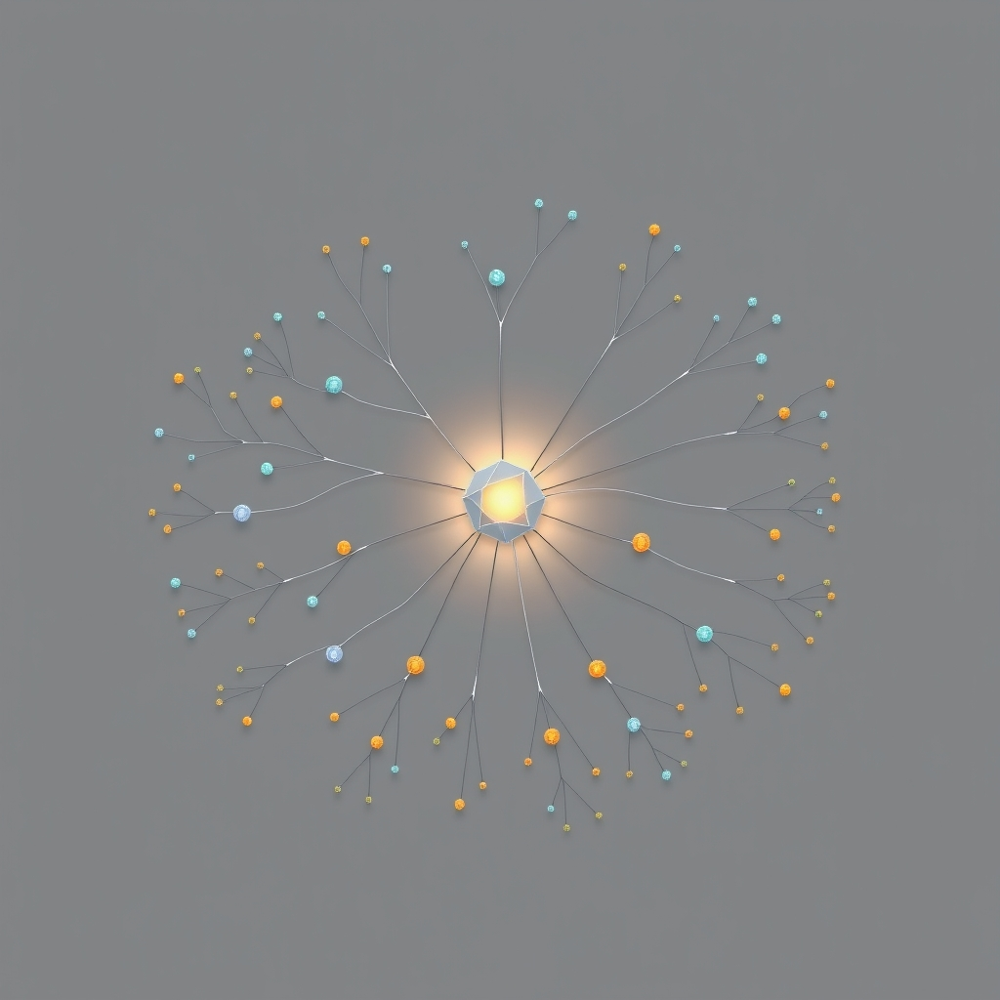

[Home](../index.md) > [Reflections](./index.md) | [⏮️](./2024-05-20.md) [⏭️](./2024-05-29.md)  
# 2024-05-28 | 🧠🗺️ Mind Mapping 📺  
  
## [📺 Videos](../videos/index.md)  
🧠🗺️ [What I Learned after 5000 Hours of Mind Mapping](../videos/what-i-learned-after-5000-hours-of-mind-mapping.md)  
