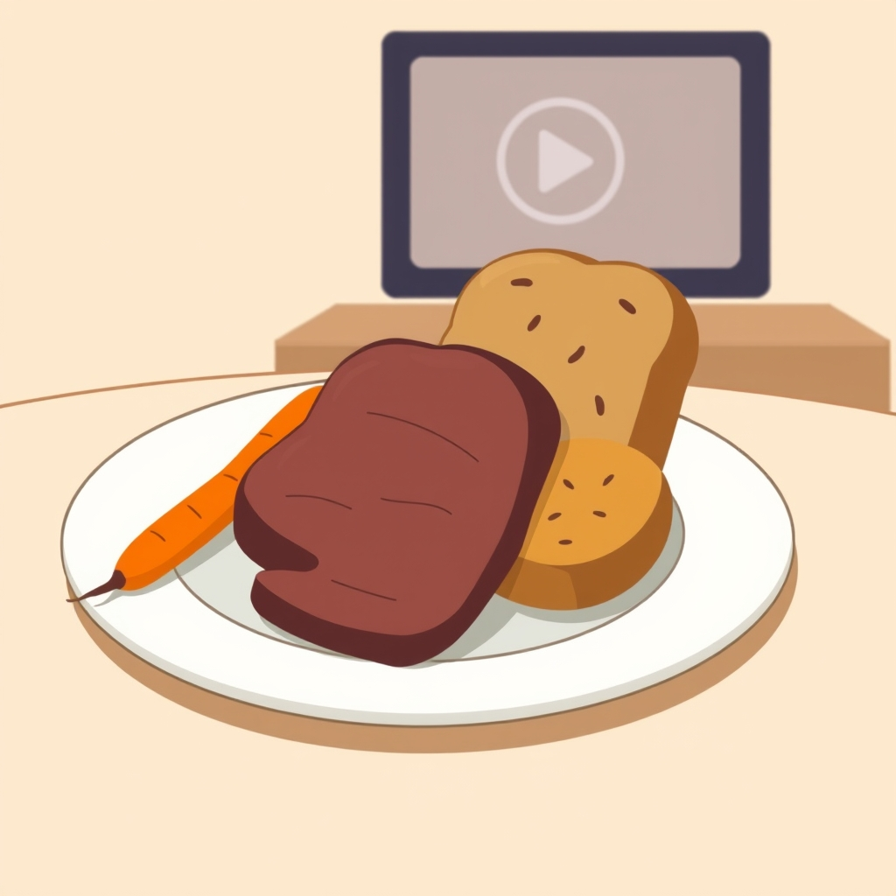

[Home](../index.md) > [Reflections](./index.md) | [⏮️](./2024-05-28.md) [⏭️](./2024-05-30.md)  
# 2024-05-29 | 🥕🍖🍞 Food Order 📺  
  
## [📺 Videos](../videos/index.md)  
🥦🍗🍚 [Eat your food in the RIGHT ORDER: 75% healthier with this small trick | Episode 6 of 18](../videos/eat-your-food-in-the-right-order-75-healthier-with-this-small-trick-episode-6-of-18.md)  
  
## 🦋 Bluesky    
<blockquote class="bluesky-embed" data-bluesky-uri="at://did:plc:i4yli6h7x2uoj7acxunww2fc/app.bsky.feed.post/3mpdn4wfu5u2t" data-bluesky-cid="bafyreiegpbgzunvkia2k2pwjvgrkcaof4r3oimc6dsue5neuqkz7cjg66y">
2024-05-29 | 🥕🍖🍞 Food Order 📺  
  
#AI Q: 🥗 Does the sequence of food on your plate change how you feel?  
  
🥦 Dietary Habits | 🧬 Metabolic Wellness | 📺 Health Insights  
https://bagrounds.org/reflections/2024-05-29
&mdash; <a href="https://bsky.app/profile/did:plc:i4yli6h7x2uoj7acxunww2fc?ref_src=embed">Bryan Grounds (@bagrounds.bsky.social)</a> <a href="https://bsky.app/profile/did:plc:i4yli6h7x2uoj7acxunww2fc/post/3mpdn4wfu5u2t?ref_src=embed">2026-06-28T09:14:43.000Z</a></blockquote>