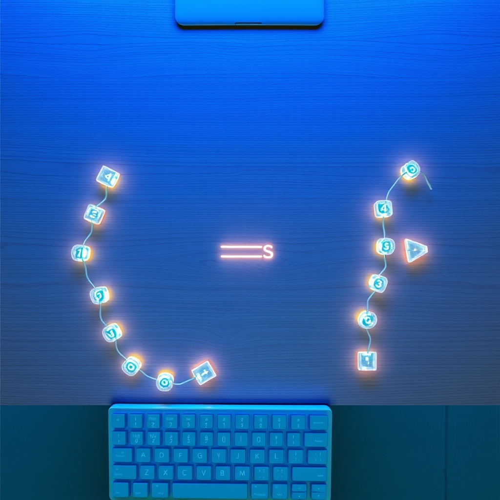

[Home](../index.md) > [Reflections](./index.md) | [⏮️](./2024-05-30.md) [⏭️](./2024-06-01.md)  
# 2024-05-31 | ➕ Add Two Numbers ⌨️  
  
## 🏋🏻 Practice  
  
- https://leetcode.com/problems/add-two-numbers  
> You are given two **non-empty** linked lists representing two non-negative integers. The digits are stored in **reverse order**, and each of their nodes contains a single digit. Add the two numbers and return the sum as a linked list.  
>  
> You may assume the two numbers do not contain any leading zero, except the number 0 itself.  
```ts  
/**  
 * Definition for singly-linked list.  
 * class ListNode {  
 *     val: number  
 *     next: ListNode | null  
 *     constructor(val?: number, next?: ListNode | null) {  
 *         this.val = (val===undefined ? 0 : val)  
 *         this.next = (next===undefined ? null : next)  
 *     }  
 * }  
 */  
  
/* Plan  
Possible approaches  
1. follow the linked lists and add digit by digit with carries  
2. decode each list into a number, add normally, encode result as a linked list  
  
- There are up to 100 nodes, i.e. 100 digits, so decoding and adding would require big ints if it works at all.  
- Both approaches have equivalent big-o algorithmic run-time complexity: O(N)  
- The work required to decode and encode may be higher, but the potential for bugs in addition is lower  
- The spirit of the problem seems to want us to add with carry, though that could just be a framing bias  
- I'll try both, but start with adding with carry, just to practice attention to detail  
  
Adding with carry:  
1. initialize the result linked list  
2. initialize a carry variable  
3. traverse both lists simultaneously  
  a. add the digits  
  b. if the result is greater than 9, set this digit and the carry digit appropriately  
  c. take care to always set or reset the carry digit appropriately  
  d. carefully check each list for null nodes; adjust addition accordingly  
*/  
function addTwoNumbers(l1: ListNode | null, l2: ListNode | null): ListNode | null {  
  let carry = 0  
  // we initialize the result so we can return it when we're done  
  let result: ListNode  
  // c1, c2, and cr are cursors for l1, l2, and result, respectively  
  for (let c1 = l1, c2 = l2, cr = result; c1 || c2 || carry; c1 = c1?.next, c2 = c2?.next) {  
    // current digit for l1  
    const d1: number = c1?.val || 0  
    // current digit for l2  
    const d2: number = c2?.val || 0  
    // current digit for result with carry (can be greater than 9)  
    const drwc: number = d1 + d2 + carry  
    // current digit for result without carry (max 9)  
    const dr = drwc % 10  
    carry = Math.floor(drwc / 10)  
    if (!result) {  
      // only called on the very first iteration  
      // we could have initialized outside the for-loop, but then the bookkeeping inside  
      // the for-loop would have to not add the first time... 6 of one half dozen of the other  
      result = new ListNode(dr, null)  
      cr = result  
    } else {  
      cr.next = new ListNode(dr, null)  
      cr = cr.next  
    }  
  }  
  return result  
}  
```