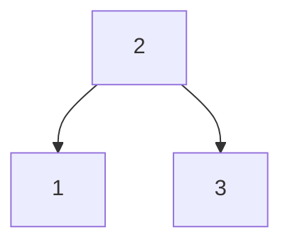

---  
share: true  
aliases:  
  - 2024-06-06  
title: 2024-06-06  
URL: https://bagrounds.org/reflections/2024-06-06  
Author: "[[bryan-grounds]]"  
tags:   
---  
[Home](../index.md) > [Reflections](./index.md) | [⏮️](./2024-06-05.md) [⏭️](./2024-06-07.md)  
# 2024-06-06  
## 🏋️ Practice  
[94. Binary Tree Inorder Traversal](https://leetcode.com/problems/binary-tree-inorder-traversal)  
  
### Problem Statement  
> Given the `root` of a binary tree, return _the inorder traversal of its nodes' values_.  
  
### 🪞 Reflections  
1. I don't remember what inorder traversal means (or preorder or postorder).  
- I can't infer what it means based on the examples in this problem.  
- The name doesn't seem to imply the meaning.  
2. So I'm not going to try this problem yet. Instead, I'll do some research and brush up on these terms.  
  
### 🔍 Research  
🌲 [Tree Traversal](../topics/tree-traversal.md)  
➡️ Got it. In-order visits the parent in-between the children. Thankfully, an in-order traversal returns nodes in-order for a binary search tree.  
  
#### In-order traversal  

📚 A stack (explicitly or implicitly via the call-stack) will be useful during implementation.  
  
### Back to our problem  
It still took a bit of planning to settle on an implementation.  
Initially, I was thinking about how to use a stack for an iterative solution.  
I was not at all certain about this algorithm, so I pivoted to a recursive plan.  
I was confident in the recursive plan, which yielded a very concise implementation.  
I found 1 bug during my 4th test case, which included a sub-tree to traverse.  
  
After finishing my timed trial, I did various (untimed) refactorings, including refactoring to use an iterative algorithm with an explicit stack.  
Refactored solutions are below the first.  
  
### 🪞 Reflections  
1. It's good to brush up on tree traversals  
2. When a recursive implementation is natural, use it  
3. If we must define an iterative version...  
- define the recursive version first  
- identify the variables we'll need in our stack frames  
- figure out how to explicitly discriminate between the base case and recursive calls  
- convert function arguments to an appropriate stack frame and push it onto a stack  
- while the stack is not empty, process the next frame (which may involve pushing more frames on the stack)  
4. 30 minutes is not too bad for my first time implementing this in a long time  
5. Studying to familiarize myself with the concepts before attempting the problem worked well  
6. Practicing common algorithms like this is probably a good idea to speed things up  
  
### My Solutions  
```ts  
/* Return the inorder traversal of a binary tree's values  
Notes:  
1. in-order is a depth-first search  
2. we visit the parent node in-between the children nodes  
  
Plan:  
1. Initialize a stack  
2. Initialize the return array  
3. Traversal - For each node  
  a. if the left node is null  
    i. push the parent into the result array  
    ii. else push the right child and the parent onto the stack and visit the left child  
  b. if both children are null  
    i. push the parent into the result array, then pop the next node off the stack  
... okay, this is actually difficult. Maybe I should try a recursive implementation instead  
  
Recursive plan:  
1. define collect nodes  
  a. return an array of nodes collected via in-order traversal  
  b. base case: null node: return an empty array  
  c. recursive case: return collect nodes of the left child + current node + collect nodes of the right child  
    
This seems more straight-forward.  
[19:07] planning complete  
[21:50] initial implementation complete  
[29:40] finished testing (4 test cases; 1 bug found), successful local test  
1 bug found: initially I was mapping over child nodes returned from recursive calls to get the .val out. During test 4, I realized that we're already returning vals, not nodes, so no mapping is necessary.  
[30:04] submit - success!  
  
Run-time complexity: O(N) in the size of the tree - we visit each node once  
*/  
  
/**  
 * Definition for a binary tree node.  
 * class TreeNode {  
 *     val: number  
 *     left: TreeNode | null  
 *     right: TreeNode | null  
 *     constructor(val?: number, left?: TreeNode | null, right?: TreeNode | null) {  
 *         this.val = (val===undefined ? 0 : val)  
 *         this.left = (left===undefined ? null : left)  
 *         this.right = (right===undefined ? null : right)  
 *     }  
 * }  
 */  
  
function inorderTraversal1(root: TreeNode | null): number[] {  
  // 1. root=null  
  // 2. root={val: 1}  
  // 3. root={val: 2, left:{val:1}, right:{val:3}}  
  // 4. root={val: 2, left:{val:1}, right:{val:4,left:3,right:5}}  
  if (!root) {  
    return []  
    // 1. return []  
  }  
  return [  
    ...inorderTraversal(root.left),  
      // 2. []  
      // 3. [1]  
      // 4. [1]  
    root.val,  
    // 2. 1  
    // 3. 2  
    // 4. 2  
    ...inorderTraversal(root.right)  
      // 2. []  
      // 3. [3]  
      // 4. [3,4,5]  
  ]  
  // 2. [1]  
  // 3. [1,2,3]  
  // 4. [1,2,3,4,5]  
};  
  
// single expression implementation for fun:  
const inorderTraversal2 = (root: TreeNode | null): number[] => !root  
  ? []  
  : [...inorderTraversal(root.left), root.val, ...inorderTraversal(root.right)]  
  
// iterative solution with an explicit stack  
function inorderTraversal3(root: TreeNode | null): number[] {  
  // 1. root=null  
  // 2. root={val:1}  
  // 3. root={val:2,left:{val:1},right:{val:3}}  
  // 4. root={val:2,left:{val:1},right:{val:4,left:{val:3},right:{val:5}}}  
  const stack: (TreeNode | number)[] = []  
  const result: number[] = []  
  let cursor: TreeNode | null | number = root  
  // 1. cursor=null  
  // 2. cursor={val:1}  
  // 3. cursor={val:2,left:{val:1},right:{val:3}}  
  // 4. cursor={val:2,left:{val:1},right:{val:4,left:{val:3},right:{val:5}}}  
  while (cursor != null) {  
    if (typeof cursor === 'number') {  
      result.push(cursor)  
      // 2.2 result=[1]  
      // 3.3 result=[1]  
      // 3.4 result=[1,2]  
      // 3.6 result=[1,2,3]  
      // 4.3 result=[1]  
      // 4.4 result=[1,2]  
      // 4.7 result=[1,2,3]  
      // 4.8 result=[1,2,3,4]  
      // 4.10  result=[1,2,3,4,5]  
    } else {  
      if (cursor.right) stack.push(cursor.right)  
      // 3.1 stack=[{val:3}]  
      // 4.1 stack=[{val:4,left:{val:3},right:{val:5}}]  
      // 4.5 stack=[{val:5}]  
      stack.push(cursor.val)  
      // 2.1 stack=[1]  
      // 3.1 stack=[{val:3},2]  
      // 3.2 stack=[{val:3},2,1]  
      // 3.5 stack=[3]  
      // 4.1 stack=[{val:4,left:{val:3},right:{val:5}},2]  
      // 4.2 stack=[{val:4,left:{val:3},right:{val:5}},2,1]  
      // 4.5 stack=[{val:5},4]  
      // 4.6 stack=[{val:5},4,3]  
      // 4.9 stack=[5]  
      if (cursor.left) stack.push(cursor.left)  
      // 3.1 stack=[{val:3},2,{val:1}]  
      // 4.1 stack=[{val:4,left:{val:3},right:{val:5}},2,{val:1}]  
      // 4.5 stack=[{val:5},4,{val:3}]  
    }  
    cursor = stack.pop()  
    // 2.1 cursor=1 stack=[]  
    // 2.2 cursor=undefined stack=[]  
    // 3.1 cursor={val:1} stack=[{val:3},2]  
    // 3.2 cursor=1 stack=[{val:3},2]  
    // 3.3 cursor=2 stack=[{val:3}]  
    // 3.4 cursor={val:3} stack=[]  
    // 3.5 cursor=3 stack=[]  
    // 3.6 cursor=undefined stack=[]  
    // 4.1 cursor={val:1} stack=[{val:4,left:{val:3},right:{val:5}},2]  
    // 4.2 cursor=1 stack=[{val:4,left:{val:3},right:{val:5}},2]  
    // 4.3 cursor=2 stack=[{val:4,left:{val:3},right:{val:5}}]  
    // 4.4 cursor={val:4,left:{val:3},right:{val:5}} stack=[]  
    // 4.5 cursor={val:3} stack=[{val:5},4]  
    // 4.6 cursor=3 stack=[{val:5},4]  
    // 4.7 cursor=4 stack=[{val:5}]  
    // 4.8 cursor={val:5} stack=[]  
    // 4.9 cursor=5 stack=[]  
    // 4.10 cursor=undefined stack=[]  
  }  
  return result  
  // 1. return []  
  // 2. return [1]  
  // 3. return [1,2,3]  
  // 4. return [1,2,3,4,5]  
};  
  
// while -> for (tightens variable scope)  
function inorderTraversal4(root: TreeNode | null): number[] {  
  const result: number[] = []  
  for (let stack: (TreeNode | number)[] = [root]; stack[0] != null;) {  
    const frame = stack.pop()  
    if (typeof frame === 'number') {  
      result.push(frame)  
    } else {  
      if (frame.right) stack.push(frame.right)  
      stack.push(frame.val)  
      if (frame.left) stack.push(frame.left)  
    }  
  }  
  return result  
};  
  
type Frame = { type: 'traverse'; tree: TreeNode } | { type: 'value'; value: number }  
  
const exhaustive = (v: never): void => {  
  throw new Error(`exhaustiveness check failed on value: ${v}`)  
}  
  
const frames = (n: TreeNode | null): Frame[] => {  
  const result: Frame[] = []  
  if (n) {  
    if (n.right) result.push({ type: 'traverse', tree: n.right })  
    result.push({ type: 'value', value: n.val })  
    if (n.left) result.push({ type: 'traverse', tree: n.left })  
  }  
  return result  
}  
  
// type-safe stack using discriminated unions  
const inorderTraversal = (root: TreeNode | null): number[] => {  
  const result: number[] = []  
  for (let stack = frames(root); stack.length;) {  
    const frame = stack.pop()  
    switch (frame.type) {  
      case 'traverse':  
        stack.push(...frames(frame.tree))  
        break  
      case 'value':  
        result.push(frame.value)  
        break  
      default:  
        exhaustive(frame) // won't type-check if we can reach this statement  
    }  
  }  
  return result  
}  
```  
  
