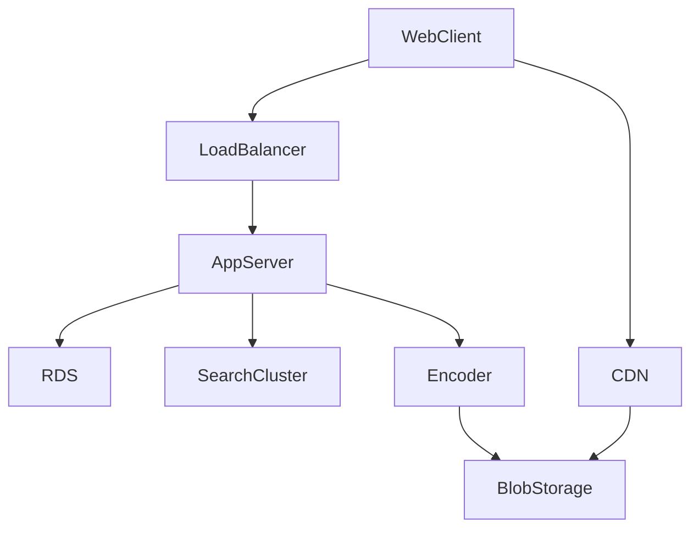

[Home](../index.md) > [Reflections](./index.md) | [⏮️](./2024-06-10.md) [⏭️](./2024-06-12.md)  
# 2024-06-11  
## 🏋 Practice 1  
### The Problem  
[5. Longest Palindromic Substring](https://leetcode.com/problems/longest-palindromic-substring)  
> Given a string `s`, return _the longest_ _palindromic_ _substring_ in `s`.  
  
### 🪞 Reflections  
1. This "Medium" level problem was a lot more difficult than I expected it to be.  
2. I identified the brute force solution pretty quickly. I recognized that it wasn't fast enough. I tried to find a faster solution, then gave up at about 25 minutes in. Implementing and testing the brute force solution only took about 6 minutes, which is pretty good.  
3. The total time I spent searching for a fast enough solution was too much for an interview.  
4. But I am pretty happy that I found a fast enough solution without having to look anything up.  
5. How did I find that solution?  
6. Well, I tried little optimizations on brute force to begin, which was unfruitful. In general, that does seem to be a theme. If I'm going to find an algorithmically faster solution, it's probably not going to be a small tweak on brute force (at least, according to my vague recollection of past experience). I kind of knew this, but decided to try it anyway because I wasn't so sure about the runtime complexity including the little tweaks, and it seemed easy (and fast) enough to be worth trying... plus I wasn't confident I'd find a truly better solution.  
7. Maybe a key insight is that finding a faster solution will usually involve a new way of thinking of the problem or at least some significant insight. It won't just be an optimization on brute force. So when searching for something algorithmically faster, maybe I should start from scratch.  
8. In this case, the key insight was that palindromes always start and end on the same character, thus we can avoid looking for palindromes when the first and last character aren't the same. Additionally, it was critical to precompute the map of indices so that we wouldn't have to use linear search when finding the last location of any given character each time we look for it.  
9. By avoiding checking for palindromes between indices that don't contain the same character, we drastically reduced the search space.  
10. By building our map up front, we spent linear time to precompute answers we'd otherwise need linear time inside a linear loop for... thus we avoided an O(N^2) overall complexity by precomputing the inner loop. We were able to precompute the inner loop because we knew exactly what we were looking for at each step of the outer loop: the other occurrences of the same character. Because we knew the answer we were looking for in advance, a constant-time lookup data structure (hash map) allowed us to jump straight to the answer.  
  
  
### My Solutions  
```ts  
/* return the longest palindrome that is a substring of s  
Questions:  
1. does the substring have to be contiguous  
The question doesn't explicitly say, but the examples are contiguous, so I'll assume that substrings are contiguous  
  
Thoughts:  
1. palindromes are easy to detect: x = x.reverse()  
2. But there are a lot of possible substrings for a given string  
3. I could start with the entire string and ask: is this a palindrome  
    a. if so, return it  
    b. else, pull one character off the beginning and ask the same  
    c. then pull one character off the end and ask the same  
    d. then drop both beginning and end and repeat the process for the smaller string  
does that actually cover all bases? or do we need to keep the possibility of removing any amount from either side?  
let's check some examples  
it works for the following cases:  
- aba  
- xaba  
- abax  
it doesn't work for this case:  
- abaxx  
So using this kind of approach, we'd need to explore each possibility: pull one character off left, pull one character off right, pull one character off left and right, pull 2 characters off left, pull 2 characters off right, etc.  
That feels like brute force: looking at every possible substring  
Runtime complexity: number of substrings of a string of length N:  
well, each character is a substring: N  
each pair of characters neighboring eachother is a substring: N/2  
each triple: N / 3  
...  
the entire string: N / N  
So this is N + N/2 + N/3 + ... + N/N = (N * (1 + 1/2 + 1/3 + 1/4 + ... + 1/N))  
This is not actually a terribly large number of options (need to look up what this converges to later). I think it's less than N * log N, which is good enough  
And I can't think of a better solution right now, so let's go with this approach.  
Oh wait, checking each substring takes time, too... how much? we need to look at each element, so it's like O(N)  
So overall, this approach would be more like N^2  
Are there substsrings I'm asking about multiple times, that I could cache?  
In the worst case, no, why would I look at the same string multiple times?  
  
Is O(N^2) good enough here?  
  
Let me think if I can come up with a better approach first.  
  
This actually reminds me a bit of prefix sums, but where the sum is actually the concatenation of characters up to a point.  
  
Can I scan the string left to right, cache the index at which a substring ends, then walk the string right to left and cache the index at which a substring begins, then look for the biggest example of a substring that begins and ends at the same index?  
  
e.g.  
abaxx  
0: a  
1: ab, b  
2: aba, ba, a  
3: abax, bax, ax, x  
4: abaxx, baxx, axx, xx, x  
  
4: x  
3: xx, x  
2: axx, ax, a  
1: baxx, bax, ba, b  
0: abaxx, abax, aba, ab, a  
  
Something's wrong with this... I only need to consider the substrings where there's enough room in the remainder of the string to reflect it  
Also, it seems complicated, and I'm almost 25 minutes in.  
  
Let's try the brute force approach now, then come back later for a more optimal version.  
  
How to implement?  
Feels recursive.  
Base case: string is a palindrome, return it  
Recursive steps:  
1. drop first char  
2. drop last char  
3. drop first and last chars (but this is already going to be covered by the first 2)  
  
[27:49] done planning  
[30:54] done with first pass implementation  
[32:55] done with 1 test  
bugs found after testing  
1. reverse doesn't exist on string  
[34:10] first submission: timeout  
*/  
const isPalindrome1 = (s: string): boolean => s === s.split('').reverse().join('')  
function longestPalindrome1(s: string): string { // aba; abax; baxx; abaxx  
  if (isPalindrome1(s)) return s // aba  
  const left = longestPalindrome1(s.slice(1)) // bax; axx; baxx  
  const right = longestPalindrome1(s.slice(0, -1)) // aba; bax; abax  
  return left.length >= right.length ? left : right  
};  
  
/* Okay, so that worked, but it's too slow.  
[35:00] return to optimization planning  
My earlier idea did contain the solution in an example  
Is it asymptotically faster than N^2 ?  
I don't think so, actually.  
  
Let me think about what I'm doing when manually walking through an example  
xababaxx  
  
I'm really just pattern matching, which isn't super helpful algorithmically.  
  
What about the recursive solution is inefficient?  
For one, we're recursively checking every substring that pops a character from the left before popping a character from the right.  
We could improve that by checking the left and the right before recursing  
Would that improve asymptotic worst case runtime complexity?  
What's the worst case? When every character is unique and we have to check every substring.  
Hmm... If we make a set of all characters in the string, we could quickly rule out checking for palindromes that involve a unique character on a the end of a string greater than length 1  
Oh, we could also improve the efficiency of our isPalindrome check by not always reversing the whole string. We can start by checking the if the first and last characters are the same, that way we more quickly rule out possibilities.  
In the worst case, that reduces the isPalindrome check to constant time (first != last)  
Then we have something like O(N * log(N))  
Let's try that  
[49:00]  
[51:33] submission still timed out  
Now let's try checking the small case before recursing  
[54:49] submission still timed out  
*/  
const isPalindrome2 = (s: string): boolean => {  
  for (let l = 0, r = s.length - 1; l !== r; l += 1, r -= 1) {  
    if (s[l] !== s[r]) return false  
  }  
  return true  
}  
function longestPalindrome2(s: string): string { // aba; abax; baxx; abaxx  
  if (isPalindrome2(s)) return s // aba  
  const leftDrop = s.slice(1)  
  if (isPalindrome2(leftDrop)) return leftDrop  
  const rightDrop = s.slice(0, -1)  
  if (isPalindrome2(rightDrop)) return rightDrop  
  const left = longestPalindrome2(leftDrop)  
  const right = longestPalindrome2(rightDrop)  
  return left.length >= right.length ? left : right  
};  
  
/* Back to the drawing board  
- A palindrome must end on the same character it begins on  
- The longest palindrome starting with C must end at or before the last occurrence of C  
- If I make a map from character to each index character occurs at  
  - I could check for palindromes intelligently, skipping cases where it will never be  
What's the runtime complexity of this?  
1. Build the map: O(N)  
2. for each character  
  - if the character occurs again, check if there's a palindrome between each occurrence  
(I also need to be able to fall back to the single character palindrome if I never find a multicharacter palindrome)  
In the case of a string of unique characters, this would take O(N), as I'm not going to check for any multi-character palindromes  
When there are additional instances, I'll check those. I'm not sure the exact runtime of this, but I think it's worth implementing.  
[1:04:57] done planning this strategy  
[1:14:40] done with first implementation  
[1:24:26] done with 1 test (which found multiple bugs and resulted in more implementation)  
bugs found after manual testing  
1. forEach does not exist on string  
2. concat does not exist on map (bad paren placement)  
3. wrong answer babad -> b (used index of indices instead of index)  
4. built map wrong (indices only contained a single index)  
5. was stopping reverse for loop (with js) too soon (off by 1)  
6. slice end index off by 1  
7. wrong answer cbbd -> c  
8. isPalindrome loop condition wrong (!== should be >)  
9. wrong answer aacabdkacaa -> aacabdkacaa (doh! l < r not l > r)  
[1:44:33] Successful submission  
*/  
function longestPalindrome(s: string): string { // abaxx  
  const isPalindrome = (i: number, j: number): boolean => { // 0 2  
    for (let l = i, r = j; l < r; l+=1, r-=1) { // 1,1 ; 0,2  
      if (s[l] !== s[r]) return false  
    }  
    return true // return true  
  }  
  
  const map = new Map()  
  s.split('').forEach((c, i) => map.set(c, [...(map.get(c) || []), i]))  
  // map={a:0,2 b:1 x:3,4}  
  let maxLength = 1  
  let maxPalindrome = s[0] // a  
  for (let i = 0; i < s.length; i++) { // 2; 1; 0  
    if (s.length - i <= maxLength) return maxPalindrome  
    const c = s[i] // a; b; a  
    const indices = map.get(c).filter(j => j > i) // []; 1; 0,2  
    for (let j = indices.length - 1; j >= 0; j--) { // 2  
      const index = indices[j]  
      const length = index - i + 1 // 3  
      if (length > maxLength) {  
        if (isPalindrome(i, index)) {  
          maxPalindrome = s.slice(i, index + 1) // aba  
          maxLength = length // 3  
          break  
        }  
      }  
    }  
  }  
  return maxPalindrome  
}  
```  
  
## System Design  
I haven't spent much time practicing system design recently. I found some course material that walks through the design of various real products and services. Before reading the course material, I'll try to do it myself. Afterword, I'll read the course material and may make some updates to my notes.  
  
### 🪞 Reflections  
1. It feels good to get some practice in system design.  
2. I was pleasantly surprised by how much similarity there was in the design notes I took before hand and the design presented in the course material.  
3. I think there are enough universal design principles for it to be worth writing them out on their own.  
4. I don't agree with all of the design decisions presented in the course material, but I think that's okay. For example, the course recommended storing videos in blob storage (as did I) but they recommended storing thumbnails in a separate, proprietary storage system that's supposed to be particularly good at storing small files. Without seeing evidence of a production problem (which I wouldn't anticipate) it seems like unnecessary added complexity to not just keep thumbnails in blob storage with videos.   
  
### Design YouTube  
What is YouTube?  
A platform where users can upload and download (watch) videos.  
Clarifying questions:  
- Who are the users?  
- How many users do we expect to have?  
- What are the goals of this project? (e.g. profit? revenue? open source?)  
- Who are the key stakeholders? (e.g. managers, users, teams, etc)  
- How broadly should the service be available? (YouTube is available everywhere in the world)  
- What are the key features we want to focus on?  
  - Video uploading?  
  - Video watching?  
  - Search?  
  - User ratings?  
- What about non-functional requirements?  
  - What kinds of latencies are acceptable?  
  - What kind of availability guarantees should we have?  
  - Are there any security concerns?  
    - Should we consider account management?  
    - DDOS protections?  
  
Focusing on the most essential elements that embody YouTube, we have a system that  
1. Has a web front end where users can  
  1. Upload videos  
  2. Watch videos  
  3. (optional) rate videos  
  4. (optional) search videos  
2. The back end will need  
  1. video storage (blob storage)  
  2. a relational database to organize content (this can also maintain video ratings, comments, and other meta-data)  
  3. it's probably good to include a search engine (e.g. elastic search for full-text videos searching by name)  
  4. application servers to decouple web clients from back end architecture, which is also good for security  
    1. Note: we probably don't want to funnel video data through our back end servers, as network bandwidth is expensive. Instead, the back end can tell the client where to point its video player.  
3. What about scalability concerns?  
  1. Do we need to replicate video data across regional data centers, or is it okay to have a single global blob storage location?  
  2. We may not need full replication across regions, but we could utilize a CDN to cache frequently accessed content in local regions.  
4. There are some interesting usage pattern distributions to consider.  
  1. Many more users will likely watch videos than upload them.  
  2. There will likely be a power-law distribution in which videos are watched - a few being watched many times, and a lot never being watched.  
  3. How can these patterns influence our design decisions?  
  4. We could, for example, allocate more resources to more popular videos, choosing to replicate that content proactively.  
5. There are interesting choices that can be made on how to present content to users.  
  1. What content should we show brand new users? Most popular content?  
  2. As users watch, like, dislike, and search content, how should we modify the content we show them by default (i.e. personalization; MLcontent recommendation systems)  
  3. How can we design search such that users can find content that doesn't necessarily match video title keywords? (e.g. tags, synonyms, phonetic search)  
6. There are interesting design decisions related to video format and quality  
  1. Video format affects video player compatibility, playback quality, and storage requirements. Standardizing storage formats can help reduce storage cost and delivery delays.  
  2. Storing video in multiple qualities allows us to offer variable quality and bandwidth for users watching from devices and networks with varying capacity and capabilities.  
  
  

      
## 🏋 Practice 2  
### The Problem  
[938. Range Sum of BST](https://leetcode.com/problems/range-sum-of-bst)  
> Given the `root` node of a binary search tree and two integers `low` and `high`, return _the sum of values of all nodes with a value in the **inclusive** range_ `[low, high]`.  
  
### 🪞 Reflections  
1. 🎉 < 15 minutes  
2. 🎉 identified recursive solution in planning phase  
3. 🤔 Technically, there's a simpler implementation that's still O(N) that doesn't conditionally descend on left and right sides. I'm not sure if it was worth adding that optimization (and risking bugs) or not.  
4. It's a good thing that I identified the recursive solution early, because implementing the iterative version seems challenging.  
5. Maybe that means I should implement the iterative solution, too.  
  
### My Solution  
```ts  
/* return the sum of values between (and including) 2 values given and a binary search tree  
- we can traverse the binary search tree with in-order traversal (left, parent, right)  
- use binary search to find the first value, the in-order traverse until we find the second value  
- keep track of the sum as we visit each node  
  
- can we do this recursively?  
sum = (c between ? c : 0) + sum (left if between) + right if between  
  
- the easiest implementation may be to in-order traverses and fill an array with the results, the filter for between and sum  
  
[10:35] finished first draft implementation  
[13:20] finished 1 test  
errors found after testing  
1. missing `: 0 ` for rightValues ternary  
2. value doesn't exist (val)  
[14:33] submission accepted  
Oh yeah, this is O(N) in the size of the search tree  
*/  
/**  
 * Definition for a binary tree node.  
 * class TreeNode {  
 *     val: number  
 *     left: TreeNode | null  
 *     right: TreeNode | null  
 *     constructor(val?: number, left?: TreeNode | null, right?: TreeNode | null) {  
 *         this.val = (val===undefined ? 0 : val)  
 *         this.left = (left===undefined ? null : left)  
 *         this.right = (right===undefined ? null : right)  
 *     }  
 * }  
 */  
  
function rangeSumBST(root: TreeNode | null, low: number, high: number): number { // [2,1,3] 2,3  
  if (!root) return 0  
  const currentValue = (low <= root.val && root.val <= high) ? root.val : 0 // 2  
  const leftValues = root.val > low ? rangeSumBST(root?.left, low, high) : 0 // 0  
  const rightValues = root.val < high ? rangeSumBST(root?.right, low, high) : 0 // recurse => 3  
  return currentValue + leftValues + rightValues // 2 + 3 = 5  
};  
```  
