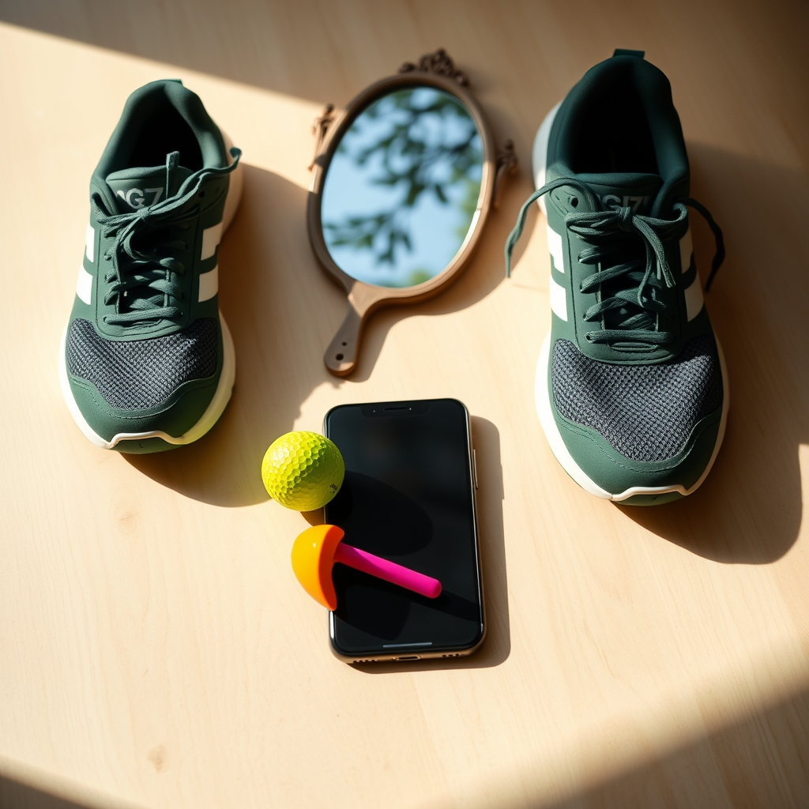

[Home](../index.md) > [Reflections](./index.md) | [⏮️](./2024-06-15.md) [⏭️](./2024-06-17.md)  
# 2024-06-16 | ⛳📞👟😴 R&R 🪞  
  
## ➖📆 A Day Off  
📞️ While walking the cats in the backyard, mom and dad and I spoke on the phone for father's day.  
⌚ Dad noticed that I'd shown up on his list of FitBit competitors, which inspired me to go for a run.  
🏃🏻 A 2.5 mile run down the usual path while listening to more [🌐🧭❓🔍🗺️ Complexity: A Guided Tour](../books/complexity.md).  
⛳ We spent the afternoon catching up with friends and playing mini golf.  
😴 I got to bed about an hour earlier than usual, ensuring I'd get plenty of sleep prior to my interview.  
🙂 It was a good day.