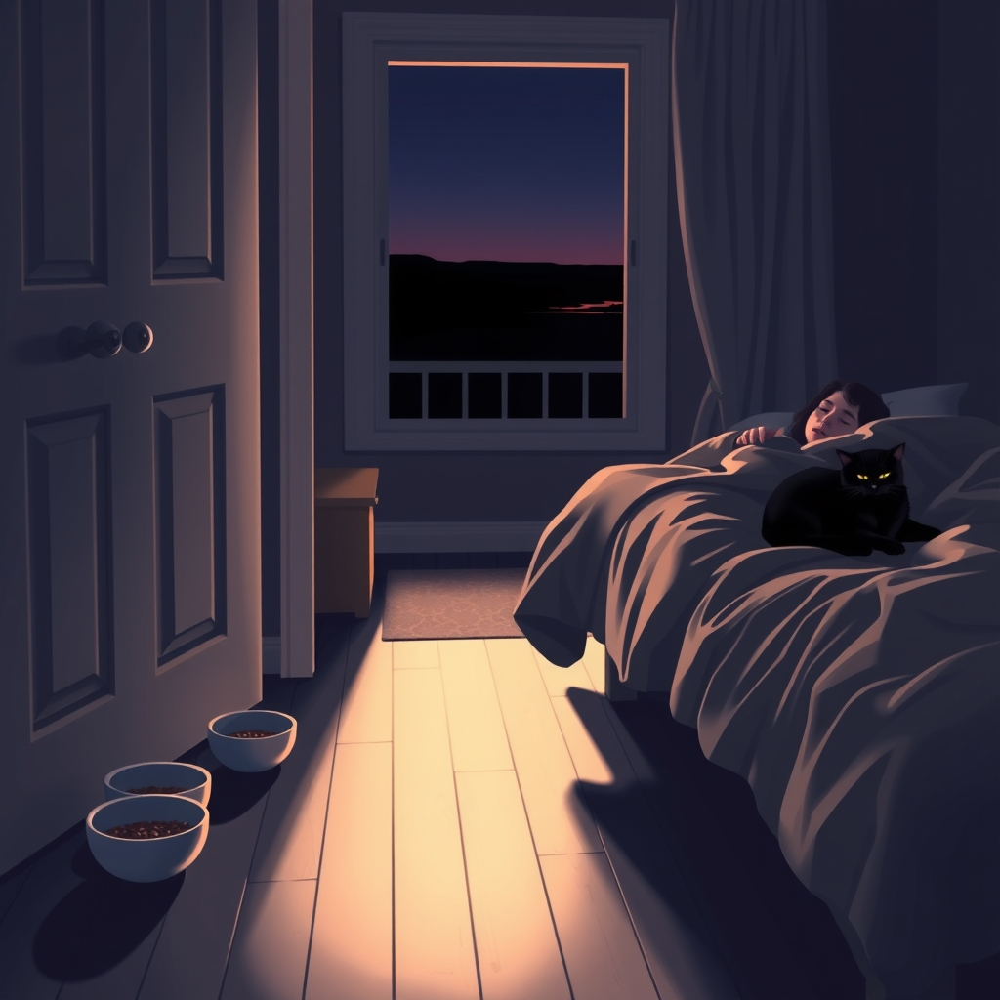

[Home](../index.md) > [Reflections](./index.md) | [⏮️](./2024-06-21.md) [⏭️](./2024-06-23.md)  
# 2024-06-22 | 😇🐈 Angels 🌃  
  
## 😇 Night Angels  
🔧 Fixing [a problem](./2024-06-21.md#👿%20Night%20Terrors).  
🥣🥣🥣 Last night, after dinner, before getting ready for bed, I opened a fresh can of cat food and served up 3 bowls.  
🚪 I set these 3 bowls just outside our bedroom door.  
🐈 Then, just before climbing into bed, I found our night terrorist, woke him up, and set him right in front of a bowl.  
😻 He began to eat.  
😴 I climbed into bed and fell asleep.  
🕔 And I didn't wake again until 5am.  
☮️ At which point I noticed that our (seemingly reformed) night terrorist was curled up against me, sleeping peacefully.  
  
🎉 Great! It worked!  
  
🤔 Hm. Now I just can't fall back to sleep.  
🤷🏻 I guess I can't blame the cat this time.  
🙂 At least I feel good.  
⌛ After an hour or so of listening to a video in a single ear bud, allowing sleep the opportunity to resume, I realized that it wasn't coming back.  
🆗 That's okay.  
🌄 I guess I'll get an early start today.  
✅ If I need a nap this afternoon, I know how to do that.