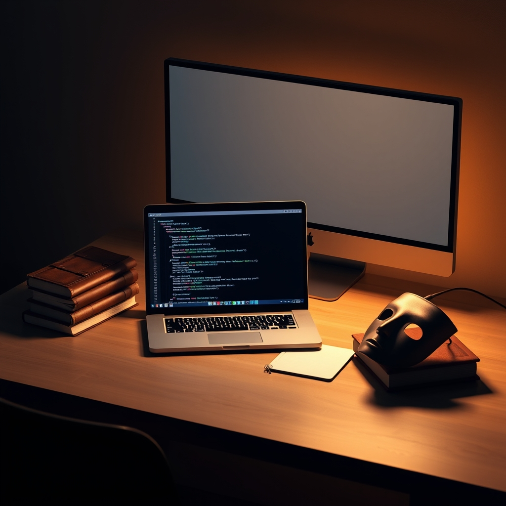

[Home](../index.md) > [Reflections](./index.md) | [⏮️](./2024-06-24.md) [⏭️](./2024-06-26.md)  
# 2024-06-25 | 👩‍💻📚🎭 Interview Prep 📺  
  
## 🧠 Education  
[🤫🔑👨‍💻 The Secret Skill Every Tech Leader Possesses](../videos/the-secret-skill-every-tech-leader-possesses.md)  
[🗑️👩‍💻👎 Most Tech Interview Prep is GARBAGE](../videos/most-tech-interview-prep-is-garbage-from-a-principal-engineer-at-amazon.md)