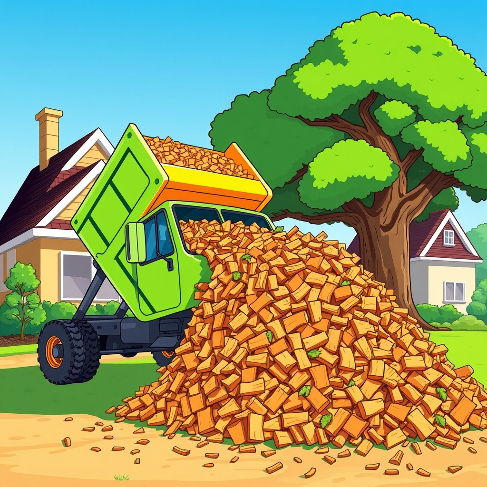

[Home](../index.md) > [Reflections](./index.md) | [⏮️](./2024-06-26.md) [⏭️](./2024-06-28.md)  
# 2024-06-27 | 🌳🪾🪵🚛🏡 ChipDrop  
  
## 🪵 [ChipDrop](https://getchipdrop.com)  
🛻 A local arborist dropped off 3 yards of free, fresh wood chip mulch today!  
