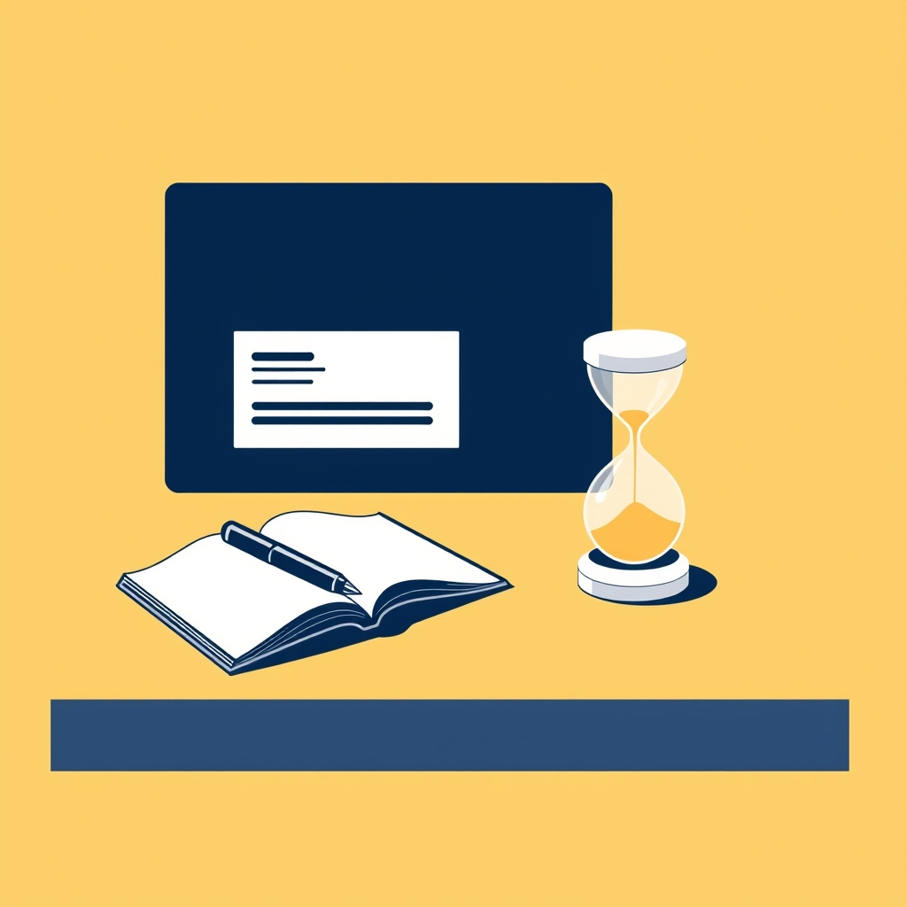

[Home](../index.md) > [Reflections](./index.md) | [⏮️](./2024-07-08.md) [⏭️](./2024-07-22.md)  
# 2024-07-20 | ⌛⏳ 2 Hours 💼📚  
  
## 🧠 Education  
⏲️ [⏳💻💼🎯 The 2-Hour Job Search: Using Technology to Get the Right Job Faster](../books/the-2-hour-job-search.md)