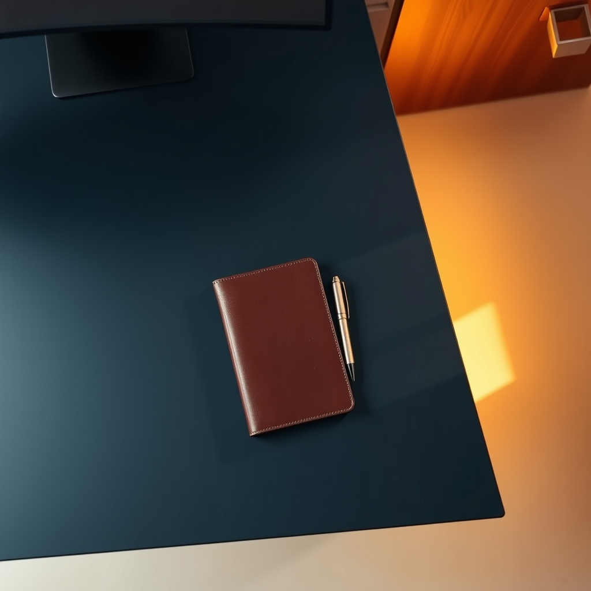

[Home](../index.md) > [Reflections](./index.md) | [⏮️](./2024-07-24.md) [⏭️](./2024-07-27.md)  
# 2024-07-25 | 💼 Job 🚪 Closer 📚  
  
## 🧠 Education  
[💼🏆 The Job Closer: Time Saving Techniques for Acing Resumes, Interviews, Negotiations, and More](../books/the-job-closer.md)