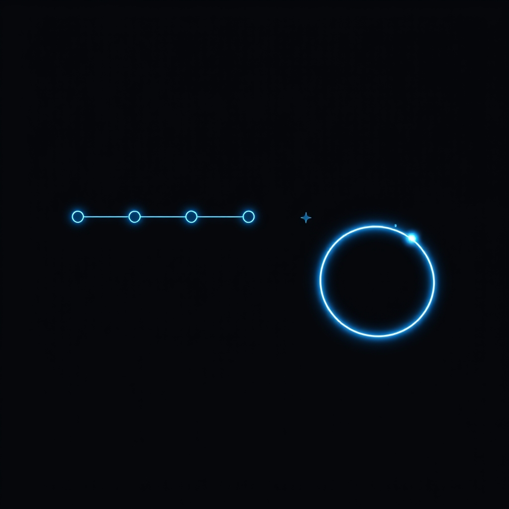

[Home](../index.md) > [Reflections](./index.md) | [⏮️](./2024-08-04.md) [⏭️](./2024-08-09.md)  
# 2024-08-07 | 🚀 Launch | 🔄 Cycle | 💡 Solve  
  
## 🧠 Education  
[🪙💯🚀 The $100 Startup: Reinvent the Way You Make a Living, Do What You Love, and Create a New Future](../books/the-100-dollar-startup.md)  
  
## 🏋 Coding Practice  
  
### [141. Linked List Cycle](https://leetcode.com/problems/linked-list-cycle)  
> Given `head`, the head of a linked list, determine if the linked list has a cycle in it.  
> There is a cycle in a linked list if there is some node in the list that can be reached again by continuously following the `next` pointer. Internally, `pos` is used to denote the index of the node that tail's `next` pointer is connected to. **Note that `pos` is not passed as a parameter**.  
> Return `true` _if there is a cycle in the linked list_. Otherwise, return `false`.  
  
#### 🪞 Reflections  
1. This was a good warm up for my upcoming interview, later today  
2. No bugs, optimal solution, correct submission on first attempt in under 14 minutes is pretty good!  
  
#### ⌨️ My Solution  
```ts  
/* Deterimine if there is a cycle in a linked list  
- Easy: collect nodes in a set and check if each new node exists in the set  
  - Note: O(N) extra memory usage  
- Old PhD Thesis method, turned ubiquitous interview question: send out multiple cursors at different paces and return if they're ever at the same node  
  - O(1) extra memory usage  
Both methods have O(N) run-time complexity  
[2:24] Done planning  
[6:34] Done with initial implementation  
[9:18] Done with test  
[13:25] Successful submission  
*/  
/**  
 * Definition for singly-linked list.  
 * class ListNode {  
 *     val: number  
 *     next: ListNode | null  
 *     constructor(val?: number, next?: ListNode | null) {  
 *         this.val = (val===undefined ? 0 : val)  
 *         this.next = (next===undefined ? null : next)  
 *     }  
 * }  
 */  
  
function hasCycle(head: ListNode | null): boolean { // null; 1,2,3,1  
  if (!head || !head.next) return false // F  
  
  for (let c1 = head, c2 = head.next; c2.next && c2.next.next; c1 = c1.next, c2 = c2.next) {  
    // c1=2 c2=1; c1=1 c2=2  
    if (c1 === c2) return true  
    c2 = c2.next // c2=2; c2=3  
    if (c1 === c2) return true // T  
  }  
  return false  
};  
```