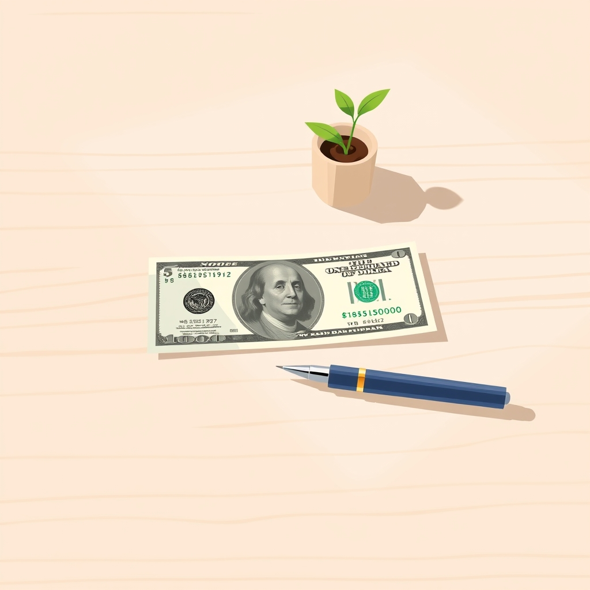

[Home](../index.md) > [Reflections](./index.md) | [⏮️](./2024-08-07.md) [⏭️](./2024-08-12.md)  
# 2024-08-09 | 💲 100 | 🫡 Motivation  
  
## 🧠 Education  
- [🪙💯🚀 The $100 Startup: Reinvent the Way You Make a Living, Do What You Love, and Create a New Future](../books/the-100-dollar-startup.md)  
- [🥱💭✂️🎬🫡 How to Force Your Brain To Be Motivated (when you don’t feel like it)](../videos/how-to-force-your-brain-to-be-motivated-when-you-dont-feel-like-it.md)