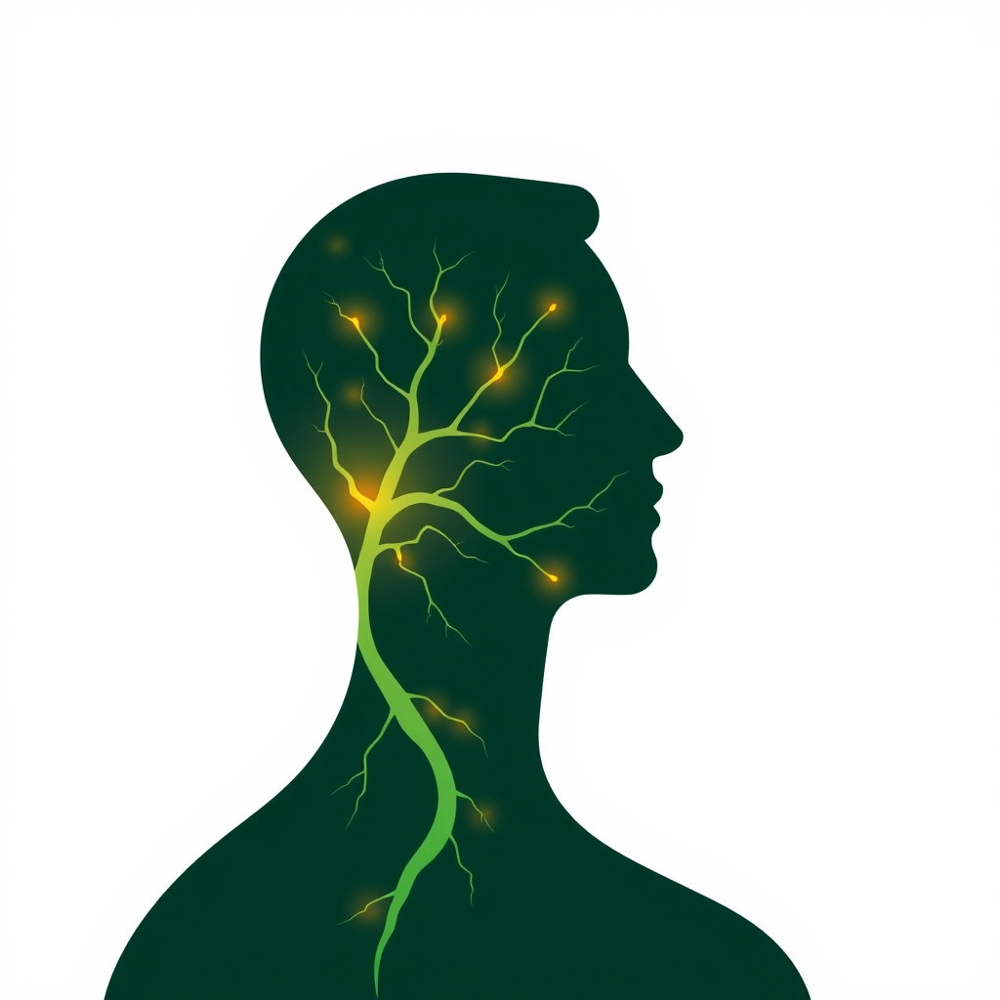

[Home](../index.md) > [Reflections](./index.md) | [⏮️](./2024-08-09.md) [⏭️](./2024-08-14.md)  
# 2024-08-12 | 🍃🧠🤝🏼 Influence  
  
## 🧠 Education  
[🍃🧠🤝🏼 Influence: The Psychology of Persuasion](../books/influence.md)