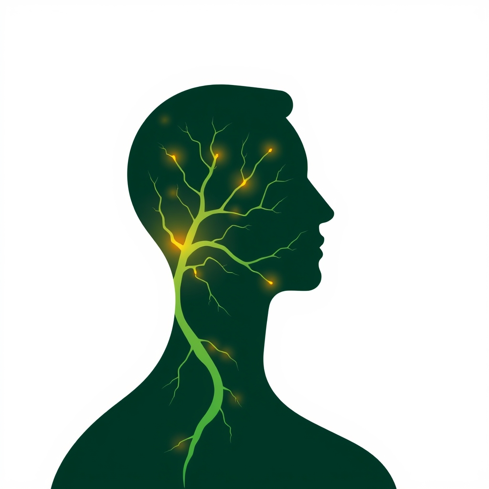

[Home](../index.md) > [Reflections](./index.md) | [⏮️](./2024-08-09.md) [⏭️](./2024-08-14.md)  
# 2024-08-12 | 🍃🧠🤝🏼 Influence  
  
## 🧠 Education  
[🍃🧠🤝🏼 Influence: The Psychology of Persuasion](../books/influence.md)  
  
## 🦋 Bluesky    
<blockquote class="bluesky-embed" data-bluesky-uri="at://did:plc:i4yli6h7x2uoj7acxunww2fc/app.bsky.feed.post/3mvcxiqs5s22y" data-bluesky-cid="bafyreihnytalc4q6tuumxtc47jveytx6dpf3zmhy4rxwceahnb6pbc4v2u">
2024-08-12 | 🍃🧠🤝🏼 Influence  
  
#AI Q: 🧠 Which persuasion tactic works best on you?  
  
Influence&#34;. None of these tags use &#34;Influence&#34;.  
https://bagrounds.org/reflections/2024-08-12
&mdash; <a href="https://bsky.app/profile/did:plc:i4yli6h7x2uoj7acxunww2fc?ref_src=embed">Bryan Grounds (@bagrounds.bsky.social)</a> <a href="https://bsky.app/profile/did:plc:i4yli6h7x2uoj7acxunww2fc/post/3mvcxiqs5s22y?ref_src=embed">2026-09-12T11:18:47.000Z</a></blockquote>