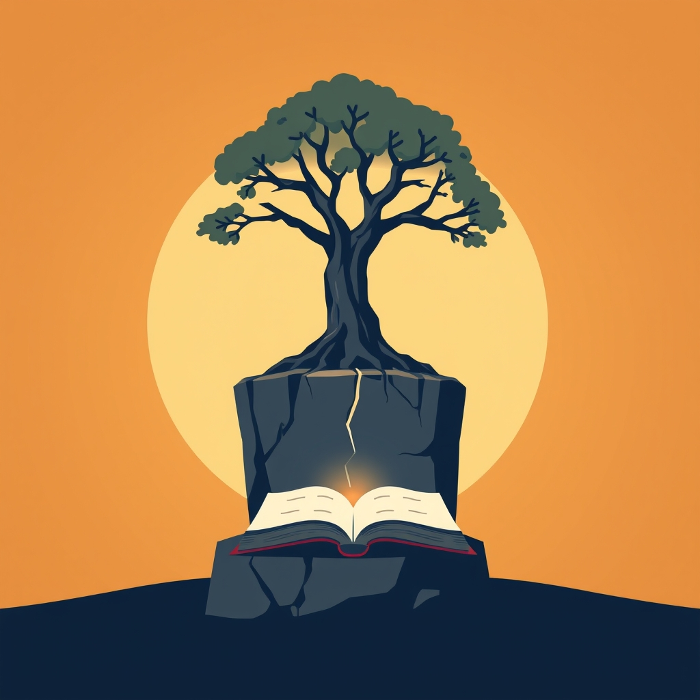

[Home](../index.md) > [Reflections](./index.md) | [⏮️](./2024-08-14.md) [⏭️](./2024-09-06.md)  
# 2024-09-04 | 💪 Willpower 📖  
  
## 🧠 Education  
[💪📈 Willpower: Rediscovering the Greatest Human Strength](../books/willpower.md)