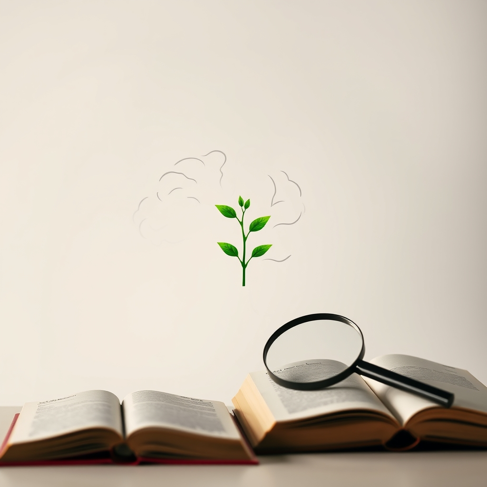

[Home](../index.md) > [Reflections](./index.md) | [⏮️](./2024-09-04.md) [⏭️](./2024-09-11.md)  
# 2024-09-06 | 🌱🧠 Mindset 🔬📖  
  
## 🧠 Education  
[🌱🧘🏼‍♀️🏆 Mindset: The New Psychology of Success](../books/mindset.md)