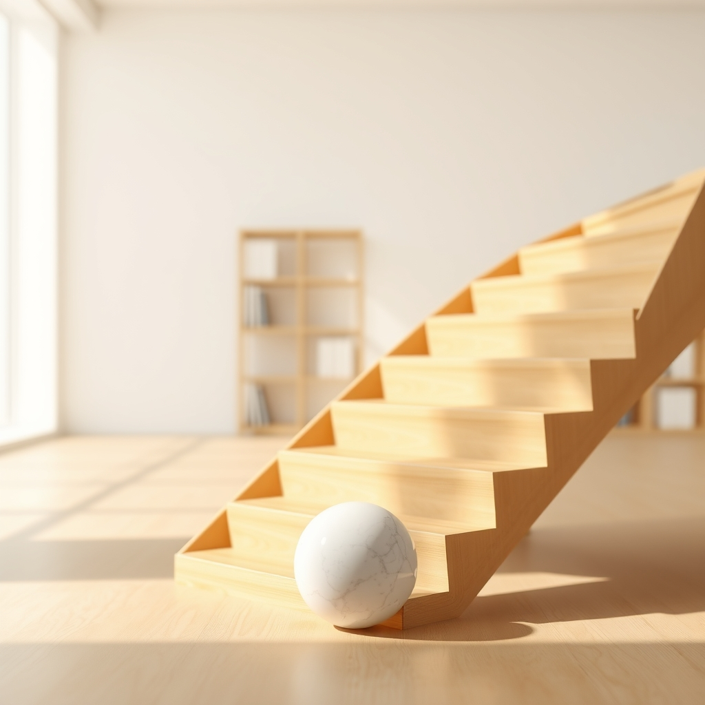

[Home](../index.md) > [Reflections](./index.md) | [⏮️](./2024-09-06.md) [⏭️](./2024-09-22.md)  
# 2024-09-11 | ⚛️ Atomic 🔄 Habits  
  
## 🧠 Education  
[⚛️🔄 Atomic Habits: An Easy & Proven Way to Build Good Habits & Break Bad Ones](../books/atomic-habits.md)