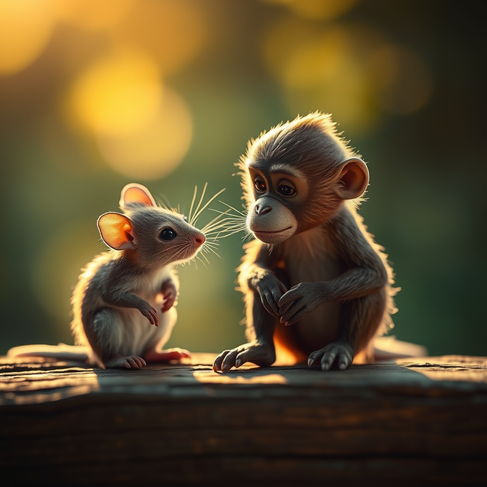

[Home](../index.md) > [Reflections](./index.md) | [⏮️](./2024-10-10.md) [⏭️](./2024-10-30.md)  
# 2024-10-19 | 🐒 Rapport 🐭  
  
## 🧠 Education  
[🤝🐾 Rapport: The Four Ways to Read People](../books/rapport.md)