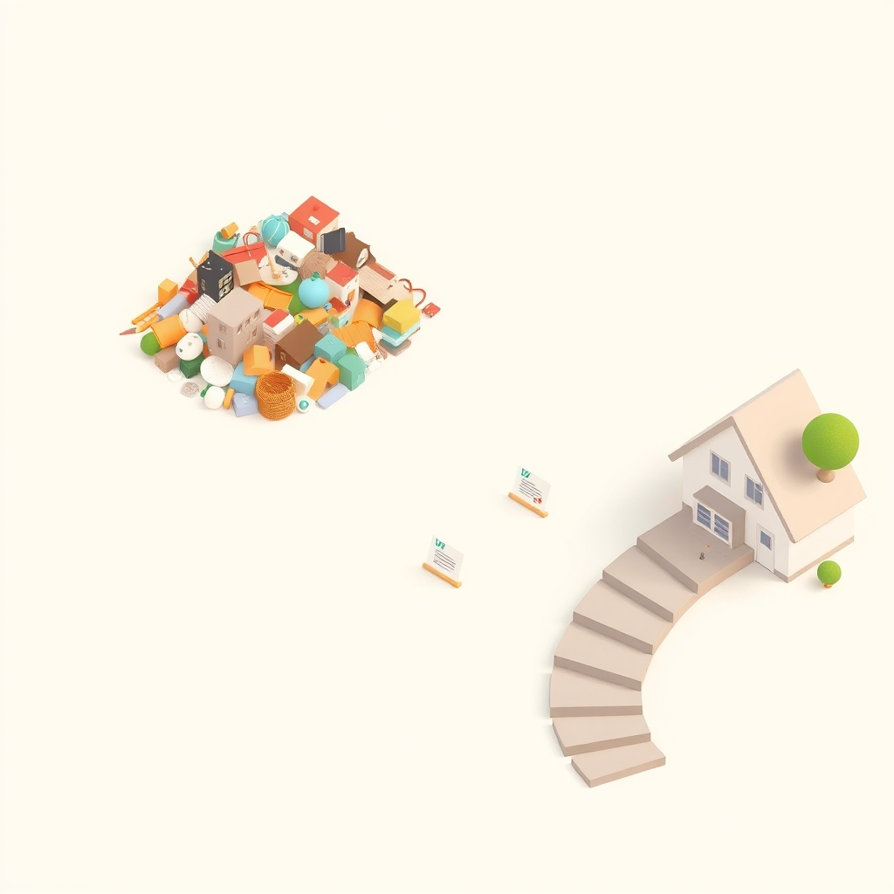

[Home](../index.md) > [Reflections](./index.md) | [⏮️](./2024-10-30.md) [⏭️](./2024-11-01.md)  
# 2024-10-31 | 🪜 Linear 🏡 Living 🛣️  
  
## 🤔 More thoughts on [Linear Processes](../topics/linear-processes.md)  
### 🏡 Household Chores  
😩 I don't love doing dishes.  
😊 But we have a nice process that makes it easy to do a little at a time.  
🧺 Same with laundry.  
🤔 Something about this reminds me of a Kanban planning scheme I designed for work a while back.  
  
### 🚦 Kanban  
🤔 Actually, I think these are all examples of Kanban systems.  
🚦 In Kanban, the flow of work is not necessarily represented by paper cards or digital representations of sticky notes.  
🧺 A basket that moves laundry from the bedroom to the laundry room is a form of Kanban.  
➡️ Maybe these are all _[Linear Processes](../topics/linear-processes.md)_.  
  
### 🌀 Non-linear processes  
🤔 I think I tend to think of home organization as a non-linear process.  
🏠 It's big, complex, and overwhelming.  
👷 To make progress, I may need to hire experts and spend days organizing and engineering systems to maintain organization.  
🌪️ A flurry of intense activity is required in a short period of time.  
⚠️ Otherwise we may wind up with half the house inside out and unusable, making things worse.  
  
### ⚙️ System Design  
🤔 But maybe it doesn't have to be that way.  
💡 Maybe we can design an organization process that is nice in the same way that the dishes 🍽️, laundry 🧺, and Kanban planning 🚦 are nice.  
🪜 A process where incremental progress can happen a little at a time.  
🤏 Where a little work yields a little improvement.  
😌 This would make the effort a lot less overwhelming.  
👍 A lot easier.  
✅ Progress could be made.  
  
### ➡️ Linear Organization  
🤔 What would this linear home organization process look like?  
💭 I'm imagining a system that looks like combination of Kanban planning 🚦 and laundry 🧺.  
👩‍❤️‍👨 My wife and I can collect ideas on a Kanban board.  
✏️ A little at a time, we can expand and define these ideas, adding critical details about goals, outcomes, and the steps necessary to move ideas to reality.  
✅ When an idea is well fleshed out and we agree it should be done, we can start working one little step at a time.  
➡️ The execution plan should be linear to be well behaved.  
⚠️ Each step should leave the house in a state of minimal disruption.  
👚 We don't want a closet organization project paused in a way that prevents us from getting dressed on a daily basis.  
  
### 🤔 Much Ado about Planning?  
🧘 I pause and reflect.  
🤯 This feels almost revolutionary.  
🤩 Exciting.  
✨ Novel.  
😲 Wow.  
➡️ A way convert a big, overwhelming, potentially disruptive venture into a series of small, easy, safe steps to achieve a goal.  
📐 Designing _linear processes_!  
🤯 Wow. So sophisticated. The welding of abstract mathematics to tame menacing real life projects.  
❓ Or is this just planning?  
📝 Write down a goal. 쪼 Split a big project into little tasks. ✅ Complete work a bit at a time.  
🔮 Peer into the future. 🎭 Simulate activities. 🔎 Look for problems in the simulation. ✍️ Write down the steps.  
🤔 Do people do this all the time?  
🧐 Am I discovering something obvious?  
🤷 I can't tell. 🗣️ Maybe I'll ask around.  
👍 I guess it doesn't matter much for me.  
✅ Whether planning or designing linear processes is obvious to the rest of the world or not, it's useful to me.  
  
### ✍️ Blogging  
🧠 I think this is also a linear process.  
  
1. 💡 I get an idea  
2. 📱 I open my phone  
3. ✏️ I write a few words  
4. 🚀 I publish my notes  
5. 🔄 I revisit an idea  
6. ✍️ I revise prior writing  
7. 📢 I publish again  
  
📈 I can write and publish a little at a time and my website grows on its own.  
🗓️ I did a bit of planning when I started this.  
⏳ And I've done bits more over time.  
🧱 A little more structure here, ✍️ a little more writing there.  
🌱 Continuous, gradual, incremental improvement.  
😎 Pretty cool, I think.  
  
### 🧪 A Test  
⏳ Let's see how easily I can find my notes on setting up this blogging system to drop a link.  
📝 My blogs posts are currently untitled (minus the date), which makes the [Reflections](./index.md) index of limited use.  
🔎 But I can search for key terms, like "obsidian publish" and see what comes back.  
🎉 Boom second of 2 results: [2024-04-21](./2024-04-21.md). ✅ Easy.  
🥳 Thank you, me from 6 months ago! 🚀 Look what we've done! 😊  
  
👍 Okay. Enough for now. 🌅 Back to my morning routine...  
  
## 🌐 [Static Apis](../topics/static-apis.md)  
  
## 🦋 Bluesky    
<blockquote class="bluesky-embed" data-bluesky-uri="at://did:plc:i4yli6h7x2uoj7acxunww2fc/app.bsky.feed.post/3mqlwddd3622s" data-bluesky-cid="bafyreiazooencsr3ajkafsjpyztcptxj7sa5krozxdnxj6ua4fqur3vhyu">
2024-10-31 | 🪜 Linear 🏡 Living 🛣️  
  
#AI Q: 🪜 Can big home projects be tamed by breaking them into tiny daily steps?  
  
🚦 Kanban Methodology | 🏠 Home Organization | ⚙️ System Design | 📈 Incremental Progress  
https://bagrounds.org/reflections/2024-10-31
&mdash; <a href="https://bsky.app/profile/did:plc:i4yli6h7x2uoj7acxunww2fc?ref_src=embed">Bryan Grounds (@bagrounds.bsky.social)</a> <a href="https://bsky.app/profile/did:plc:i4yli6h7x2uoj7acxunww2fc/post/3mqlwddd3622s?ref_src=embed">2026-07-14T09:45:51.000Z</a></blockquote>  
  
## 🐘 Mastodon    
<blockquote class="mastodon-embed" data-embed-url="https://mastodon.social/@bagrounds/116926613900650806/embed" style="background: #282c37; border-radius: 8px; border: 1px solid #393f4f; margin: 0; max-width: 540px; min-width: 270px; overflow: hidden; padding: 0;"> <a href="https://mastodon.social/@bagrounds/116926613900650806" target="_blank" style="align-items: center; color: #d9e1e8; display: flex; flex-direction: column; font-family: system-ui, -apple-system, BlinkMacSystemFont, 'Segoe UI', Oxygen, Ubuntu, Cantarell, 'Fira Sans', 'Droid Sans', 'Helvetica Neue', Roboto, sans-serif; font-size: 14px; justify-content: center; letter-spacing: 0.25px; line-height: 20px; padding: 24px; text-decoration: none;"> <svg xmlns="http://www.w3.org/2000/svg" xmlns:xlink="http://www.w3.org/1999/xlink" width="32" height="32" viewBox="0 0 79 75"><path d="M63 45.3v-20c0-4.1-1-7.3-3.2-9.7-2.1-2.4-5-3.7-8.5-3.7-4.1 0-7.2 1.6-9.3 4.7l-2 3.3-2-3.3c-2-3.1-5.1-4.7-9.2-4.7-3.5 0-6.4 1.3-8.6 3.7-2.1 2.4-3.1 5.6-3.1 9.7v20h8V25.9c0-4.1 1.7-6.2 5.2-6.2 3.8 0 5.8 2.5 5.8 7.4V37.7H44V27.1c0-4.9 1.9-7.4 5.8-7.4 3.5 0 5.2 2.1 5.2 6.2V45.3h8ZM74.7 16.6c.6 6 .1 15.7.1 17.3 0 .5-.1 4.8-.1 5.3-.7 11.5-8 16-15.6 17.5-.1 0-.2 0-.3 0-4.9 1-10 1.2-14.9 1.4-1.2 0-2.4 0-3.6 0-4.8 0-9.7-.6-14.4-1.7-.1 0-.1 0-.1 0s-.1 0-.1 0 0 .1 0 .1 0 0 0 0c.1 1.6.4 3.1 1 4.5.6 1.7 2.9 5.7 11.4 5.7 5 0 9.9-.6 14.8-1.7 0 0 0 0 0 0 .1 0 .1 0 .1 0 0 .1 0 .1 0 .1.1 0 .1 0 .1.1v5.6s0 .1-.1.1c0 0 0 0 0 .1-1.6 1.1-3.7 1.7-5.6 2.3-.8.3-1.6.5-2.4.7-7.5 1.7-15.4 1.3-22.7-1.2-6.8-2.4-13.8-8.2-15.5-15.2-.9-3.8-1.6-7.6-1.9-11.5-.6-5.8-.6-11.7-.8-17.5C3.9 24.5 4 20 4.9 16 6.7 7.9 14.1 2.2 22.3 1c1.4-.2 4.1-1 16.5-1h.1C51.4 0 56.7.8 58.1 1c8.4 1.2 15.5 7.5 16.6 15.6Z" fill="currentColor"/></svg> 
Post by @bagrounds@mastodon.social
 
View on Mastodon
 </a> </blockquote> 