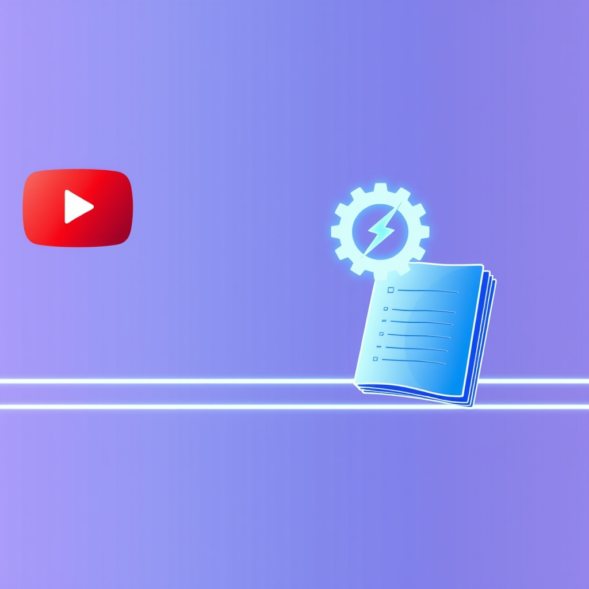

[Home](../index.md) > [Reflections](./index.md) | [⏮️](./2024-11-01.md) [⏭️](./2024-11-04.md)  
# 2024-11-03 | 🎬 Streamline | ⚡️ Automate | 📏 Lineate  
  
## 🤔 Thinking about Automating Video Notes  
- 📺 I watch a YouTube video  
- 📝 I want to make an Obsidian note of it.  
- 📲 I share to Google keep  
- if the title was too lon...  
  - 🔎 I find it elsewhere and copy it into the keep note's title  
  - ⌨️ then in obsidian, I use my video Quick add command  
    - ✂️ I copy/paste the title from my keep note into the prompt  
    - ⚠️ if there are special characters, I have to delete those  
    - ✨ then a new file is created from my template, in the right location  
    - ✏️ I paste the title into the alias and title metadata fields and update the H1 title to match the original title (without special characters removed)  
    - 🔗 I then go back to my keep note, copy the URL, and paste that in the URL metadata fields  
    - 🎬 I fill in the platform (YouTube) metadata field  
    - 👤 I fill in the channel metadata field  
- ✅ and now I can publish or write some notes  
- ⏱️ overall this doesn't take _that long_.  
  - 😩 but it's still quite a lot of friction.  
  - 🚀 and the easier a thing is, the more likely it is to happen.  
  - 🎯 making things I want to do easier is a great way to do them more often  
- 🪄 it would be cool if all of this could happen in 1 click...  
  - 🤔 what would it take to make that possible?  
    - 👨‍💻 I think a pretty straight-forward program could do this given the YouTube video's URL as input  
    - 📤 there is a share button on YouTube that sends some information about the video (including at least the URL and the title) to an receiving app that claims to be able to handle the input  
    - ➡️ I can share to Obsidian directly  
      - ⚙️ I wonder if I can configure obsidian to receive that share and run some script to automatically do all the steps...  
      - ⏳ how long would it take to set that up?  
        - 🗓️ maybe a couple of hours?  
      - 💰 and how much time would I save on each use?  
        - ⏱️ maybe a few minutes?  
- ⏱️ I'll time myself running through the whole procedure as it exists today for a couple of videos I watched this morning  
  - 📹 video 1  
    - ⏱️ 2 minutes 42 seconds  
    - 👍 this was a relatively easy example because the title is nice (short enough to not be truncated when sharing and it includes no special characters)  
  - 📹 video 2  
    - ⏱️ 1 minute 45 seconds  
    - 👍 this was easy for the same reasons as the previous video  
  - ✍️ in both of these examples, the longest step by far was manually rewriting the file name into kabob-case  
    - 🤷‍♀️ this isn't strictly necessary, but I like kabob-case for file names and URLs because all the characters are legal, well behaved, and don't require escaping  
    - 💡 it's also pretty easy to write a function that will transform an arbitrary title into kabob-case  
    - 🎣 if I can get a hook into this QuickAdd template process to run a JavaScript function to convert my title case, I could save the majority of the time required in this overall process  
  
## 🧠 Education  
⚛️ [This Single Rule Underpins All Of Physics](../videos/this-single-rule-underpins-all-of-physics.md)  
🥩 [How AI Cracked the Protein Folding Code and Won a Nobel Prize](../videos/how-ai-cracked-the-protein-folding-code-and-won-a-nobel-prize.md)  
  
## ✍️ More on [Linear Processes](../topics/linear-processes.md)  
  
## 🦋 Bluesky    
<blockquote class="bluesky-embed" data-bluesky-uri="at://did:plc:i4yli6h7x2uoj7acxunww2fc/app.bsky.feed.post/3mpic2qd6pp2b" data-bluesky-cid="bafyreiclewb6abn5jw5udejvklrz64fdx7hufw2ulofvmkudhhvip66mmy">
2024-11-03 | 🎬 Streamline | ⚡️ Automate | 📏 Lineate  
  
#AI Q: ⚙️ Which manual task do you wish you could automate with one click?  
  
📓 Obsidian Workflows | 🛠️ Productivity Systems | ✍️ Digital Note-taking | 🧪  
https://bagrounds.org/reflections/2024-11-03
&mdash; <a href="https://bsky.app/profile/did:plc:i4yli6h7x2uoj7acxunww2fc?ref_src=embed">Bryan Grounds (@bagrounds.bsky.social)</a> <a href="https://bsky.app/profile/did:plc:i4yli6h7x2uoj7acxunww2fc/post/3mpic2qd6pp2b?ref_src=embed">2026-06-30T05:39:57.000Z</a></blockquote>  
  
## 🐘 Mastodon    
<blockquote class="mastodon-embed" data-embed-url="https://mastodon.social/@bagrounds/116849628167478938/embed" style="background: #282c37; border-radius: 8px; border: 1px solid #393f4f; margin: 0; max-width: 540px; min-width: 270px; overflow: hidden; padding: 0;"> <a href="https://mastodon.social/@bagrounds/116849628167478938" target="_blank" style="align-items: center; color: #d9e1e8; display: flex; flex-direction: column; font-family: system-ui, -apple-system, BlinkMacSystemFont, 'Segoe UI', Oxygen, Ubuntu, Cantarell, 'Fira Sans', 'Droid Sans', 'Helvetica Neue', Roboto, sans-serif; font-size: 14px; justify-content: center; letter-spacing: 0.25px; line-height: 20px; padding: 24px; text-decoration: none;"> <svg xmlns="http://www.w3.org/2000/svg" xmlns:xlink="http://www.w3.org/1999/xlink" width="32" height="32" viewBox="0 0 79 75"><path d="M63 45.3v-20c0-4.1-1-7.3-3.2-9.7-2.1-2.4-5-3.7-8.5-3.7-4.1 0-7.2 1.6-9.3 4.7l-2 3.3-2-3.3c-2-3.1-5.1-4.7-9.2-4.7-3.5 0-6.4 1.3-8.6 3.7-2.1 2.4-3.1 5.6-3.1 9.7v20h8V25.9c0-4.1 1.7-6.2 5.2-6.2 3.8 0 5.8 2.5 5.8 7.4V37.7H44V27.1c0-4.9 1.9-7.4 5.8-7.4 3.5 0 5.2 2.1 5.2 6.2V45.3h8ZM74.7 16.6c.6 6 .1 15.7.1 17.3 0 .5-.1 4.8-.1 5.3-.7 11.5-8 16-15.6 17.5-.1 0-.2 0-.3 0-4.9 1-10 1.2-14.9 1.4-1.2 0-2.4 0-3.6 0-4.8 0-9.7-.6-14.4-1.7-.1 0-.1 0-.1 0s-.1 0-.1 0 0 .1 0 .1 0 0 0 0c.1 1.6.4 3.1 1 4.5.6 1.7 2.9 5.7 11.4 5.7 5 0 9.9-.6 14.8-1.7 0 0 0 0 0 0 .1 0 .1 0 .1 0 0 .1 0 .1 0 .1.1 0 .1 0 .1.1v5.6s0 .1-.1.1c0 0 0 0 0 .1-1.6 1.1-3.7 1.7-5.6 2.3-.8.3-1.6.5-2.4.7-7.5 1.7-15.4 1.3-22.7-1.2-6.8-2.4-13.8-8.2-15.5-15.2-.9-3.8-1.6-7.6-1.9-11.5-.6-5.8-.6-11.7-.8-17.5C3.9 24.5 4 20 4.9 16 6.7 7.9 14.1 2.2 22.3 1c1.4-.2 4.1-1 16.5-1h.1C51.4 0 56.7.8 58.1 1c8.4 1.2 15.5 7.5 16.6 15.6Z" fill="currentColor"/></svg> 
Post by @bagrounds@mastodon.social
 
View on Mastodon
 </a> </blockquote> 