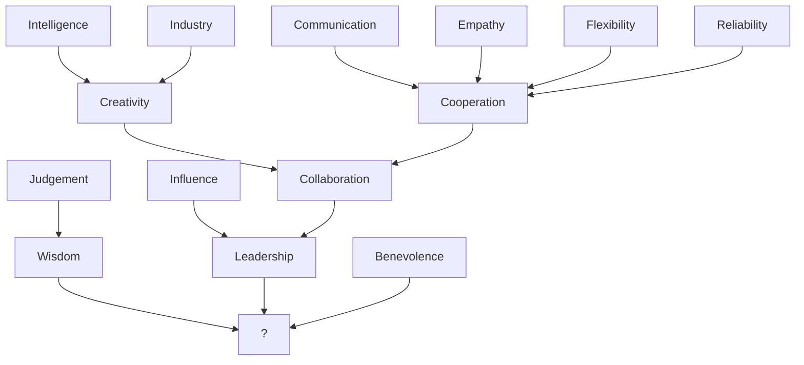

---  
share: true  
aliases:  
  - 2024-11-16  
title: 2024-11-16  
URL: https://bagrounds.org/reflections/2024-11-16  
Author: "[[bryan-grounds]]"  
tags:   
---  
[Home](../index.md) > [Reflections](./index.md) | [⏮️](./2024-11-04.md) [⏭️](./2024-11-18.md)  
# 2024-11-16  
## 🤔 What's the most valuable quality a person can have?  
- Intelligence is nice  
  - but it doesn't get things done on its own  
  - and difference can breed violence. Too much intelligence can lead to bullying, for example.  
- kindness is nice  
  - literally  
  - and it tends to be infectious, which is even better  
  - but its value is still context dependent  
    - all the kindness in the world may not help during a mugging  
- flexibility  
  - is useful in many contexts  
  - but it's passive  
- adaptability  
  - seems like flexibility with an active component  
  - it is the trait that chases survival in evolution  
  - but is survival all we can hope for?  
- creativity  
  - allows us to do more than adapt to our environment  
  - we can envision a better world and work to create it  
  - but many creative individuals working on their own may have different visions, which may produce conflict  
- collaborativity  
  - resolves the potential conflict when multiple people create  
  - but building together doesn't necessarily mean building good things together  
- leadership  
  - is like guiding a collaborative effort  
  - but how do you ensure you're leading in a good direction?  
  
It feels like these qualities may combine to form a lattice...  
  

_Note: this graph is definitely not complete. Just a partial, initial, quick sketch of an idea_  
  
🤔 Is there a word for wise, benevolent leadership?  
