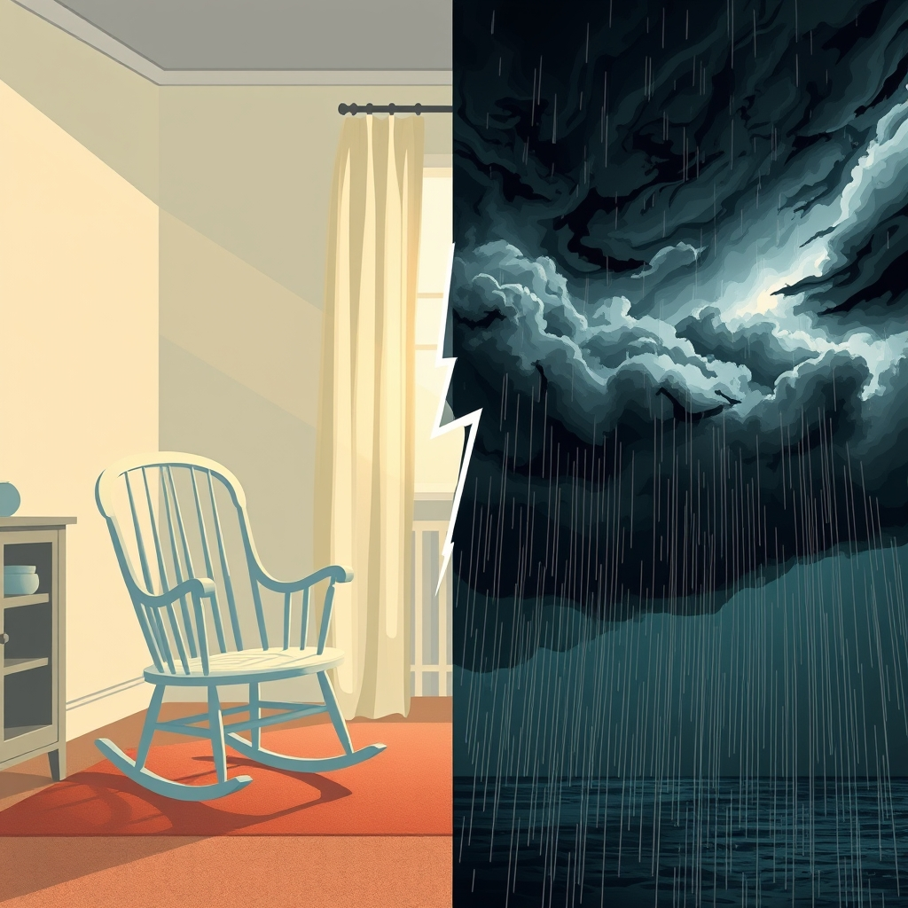

[Home](../index.md) > [Reflections](./index.md) | [⏮️](./2024-11-18.md) [⏭️](./2024-11-20.md)  
# 2024-11-19 | 🚼 Expecting 🌀 Cyclone 💣  
  
## 🧠 Education  
[🫄➕ Expecting Better: Why the Conventional Pregnancy Wisdom Is Wrong - and What You Really Need to Know](../books/expecting-better.md)  
  
## 📰 News  
💣🌀 We lost power due to [a bomb cyclone](https://www.heraldnet.com/news/bomb-cyclone-still-on-track-to-bring-high-winds-to-snohomish-county).  
