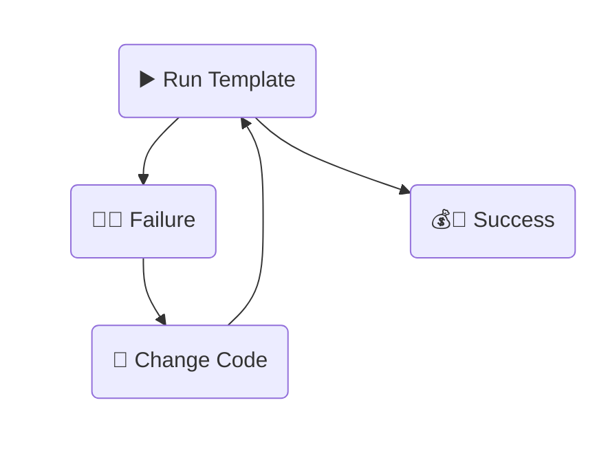

[Home](../index.md) > [Reflections](./index.md) | [⏮️](./2024-11-21.md) [⏭️](./2024-11-24.md)  
# 2024-11-23 | 📑 Template 🤖 Automation  
  
## ➕ Improving My Reflection Template  
### 🖼️ Context  
1. ✍️ [I Blog From Obsidian](./2024-04-21.md#✍%20Blogging%20From%20Obsidian)  
2. 🤖 I automate the creation of reflections with [Templater](https://github.com/SilentVoid13/Templater).  
3. 😿 But my process isn't fully automated.  
    1. 🔗🔨🥵 I manually update the ⏮️ link.  
    2. 🔗🕹️🥵 And I semi-manually add the ⏭️ link to the previous reflection.  
4. 📢📢 I want to blog more.  
5. 🥧✅ Theory: (all else equal) the easier it is, the more often I'll do it. See the [Tiny Habits Behavior Model](../books/tiny-habits.md#Behavior%20model).  
  
### 🎯 Goal  
✍️🤖 Streamline blogging.  
  
### 📐 Specification  
🔧 Update my reflection template to  
1. ⏮️ Insert the link to the previous reflection  
2. ⏭️ Insert the link to this reflection in the previous reflection  
  
### 🪜 Steps  
#### 1) 🤖 ChatGPT  
##### 🗣️❓🤖 Initial Prompt  
> I have an obsidian templater template to create a file in a folder.  
Each file in this folder is named after the current date: YYYY-MM-DD.  
I want to update the template to include a link to the most recent file.  
Can you write me a snippet of templater code to do this?  
  
##### 🤖💬🤔 Initial Response (Sans Explanation)  
_⚠️ Warning: this code is slightly broken_  
```js  
<%*  
const folderPath = 'your/folder/path'; // Replace with the path to your folder  
const today = tp.date.now("YYYY-MM-DD");  
const files = app.vault.getFiles();  
const recentFile = files  
  .filter(file => file.path.startsWith(folderPath) && file.name <= today)  
  .sort((a, b) => b.name.localeCompare(a.name))[0]; // Get the most recent file  
const link = recentFile ? `[[${recentFile.name}]]` : "No recent file found"; // Create link  
link  
%>  
```  
  
#### 2) 🔧Modify -> ▶️👀Test -> ♻️Repeat  
The first snippet didn't work.  
ChatGPT and I fixed errors and iterated.  
  

  
### 📜 Result  
My reflection template now automatically creates a previous link pointing to the most recent reflection and modifies that reflection to link to the new one! 🎉🤖🥂🥳  
  
```js  
[[index|Home]] > [[reflections/index|Reflections]] | <%*  
const folderPath = 'reflections'  
const today = tp.date.now("YYYY-MM-DD")  
const files = app.vault.getFiles()  
const recentFile = files  
  .filter(file => file.path.startsWith(folderPath) && file.name <= today)  
  .sort((a, b) => b.name.localeCompare(a.name))[0]  
  
const stripExtension = p => p.replace(/\.[^.]+$/, '')  
  
if (recentFile) {  
  const recentFilePath = stripExtension(recentFile.path)  
  const currentFilePath = recentFilePath.replace(/\d{4}(-\d{2}){2}/, today)  
  tR += `[[${recentFilePath}|⏮️]]`  
  const recentFileContent = await app.vault.read(recentFile)  
  const nextLink = `⏮️]] [[${currentFilePath}|⏭️]]`  
  const updatedContent = recentFileContent.replace('⏮️]]', nextLink)  
  await app.vault.modify(recentFile, updatedContent)  
} else {  
  tR += "No recent file found"  
}  
%>  
```  
  
### 🪞 Reflections  
1. 🤖 Chat bots help.  
    1. 🧐 They're not perfect.  
    2. 🚄 But with good prompts, some patience, and iteration, they can dramatically speed up writing (code or otherwise) by quickly generating pretty good drafts.  
2. :) I ❤️ emojis.  
3. 🤖 I ❤️ automation.  
    1. 🥧 Easier -> ✅ More  
4. 📣 I ❤️ Blogging.  
    1. 🥳 I'm having fun.  
  
## 🧑‍🚀 Exploring Quartz Features  
- [Free RSS feed and sitemap](https://quartz.jzhao.xyz/plugins/ContentIndex)  
- 💬 [Giscus Comments?!](https://quartz.jzhao.xyz/features/comments)  
  - 🤯 Did Quartz do this before or after [I did](./2024-11-20.md)?  
- 🤯 Obsidian and Quartz support [YouTube video embeds](https://quartz.jzhao.xyz/plugins/ObsidianFlavoredMarkdown) via markdown image syntax!  
  - I've been planning to eventually go through my video pages and figure out how to embed the YouTube video in the page.  
  - Now it's super easy.  
  - Check it out: [Parables on the Power of Planning in AI: From Poker to Diplomacy: Noam Brown (OpenAI)](../videos/parables-on-the-power-of-planning-in-ai-from-poker-to-diplomacy-noam-brown-openai.md)  
  
## 🧜 Troubleshooting Mermaid  
- 🤔 the graph on this page renders in Obsidian but not on my website.  
  - 🐛 on my site: syntax error, version 10.7.0  
- 🤞 let's try upgrading mermaidjs to the latest version: 11.4.0  
- 🤔 nope... Same error, different version  
- 💰 There we go...  
  - 🚛 adding a semicolon after the end bracket fixed it  
  - ⬜ I think some compilation step added whitespace after the square bracket and broke the parser  
  - ❗ I guess punctuation can be important  
  
## ⚡ Tuning the Build  
- ⏱️ Is 1 - 2 minutes too long to wait for my blog posts to publish? ✅ Yes. Let's  
  - 📦 only checkout the latest commit,  
  - 🔩 cache npm dependencies,  
  - 🔀 combine jobs,  
  - ⚙️ update GitHub actions,  
  - ⏳ reduce polling frequency,  
  - 🐳 use smaller containers with node pre-installed.  
- 🔗 Here's the GitHub workflow file [before](https://github.com/bagrounds/obsidian-github-publisher-sync/blob/981b9d7c511c9745098124030cec80cabef00798/.github/workflows/deploy.yml) and [after](https://github.com/bagrounds/obsidian-github-publisher-sync/blob/97203b53e27c508001360f7834c34c00d921e140/.github/workflows/deploy.yml).  
- 📉 We went from typically 1 - 2 minutes to typically 30 - 40 seconds.  
  - 🏃 Most of the time spent over 30 seconds is waiting for a runner.  
  - ⏳ Previously, most of the time spent over 1 minute was spent waiting for runners.  
  - ✂️ So we basically cut our build time in half.  
- ✨ Not bad!  
  - 💸 Of course, 30 seconds per build will never pay back the time I spent optimizing.  
  - ⚡ But speed is a virtue.  
    - 🚀 Lightning fast builds make it easy and rewarding to change often.  
    - 🔄 The ability to make very frequent changes allows for rapid iteration cycles that wouldn't be practical otherwise.  
    - 🤔 And perhaps I'm good at rationalizing my own behavior to avoid regret.  
- 💡 Potential for future improvement:  
  - ⬇️ reduce dependencies to minimize cache download time  
  - 💾 cache generated html and quartz build incrementally to avoid unnecessary rework.  
  
  
## 📥 Invitation  
[I recently added comments to this site.](./2024-11-20.md)  
1. 👂 What do you think?  
2. ⚖️ Have you found practical or entertainment value in anything I've written?  
3. 🪙🪙 Do you have any advice?  
4. 💬 If you have a GitHub account, let me know what you think by leaving a comment below (or how you feel by leaving an emoji reaction for this page).  
  
## 🦋 Bluesky    
<blockquote class="bluesky-embed" data-bluesky-uri="at://did:plc:i4yli6h7x2uoj7acxunww2fc/app.bsky.feed.post/3mncp3zqmkd22" data-bluesky-cid="bafyreih5jjessb7rlmavsul6tqensx3h3k3y4ndhp76ccyhkh5ldcw7vke"><p>2024-11-23 | 📑 Template 🤖 Automation  
  
#AI Q: 🤖 What is the most tedious task you have automated?  
  
📓 Obsidian Workflow | 🧠 Behavioral Science | 🚀 CI/CD Optimization | 💬 AI Script  
https://bagrounds.org/reflections/2024-11-23</p>&mdash; <a href="https://bsky.app/profile/did:plc:i4yli6h7x2uoj7acxunww2fc?ref_src=embed">Bryan Grounds (@bagrounds.bsky.social)</a> <a href="https://bsky.app/profile/did:plc:i4yli6h7x2uoj7acxunww2fc/post/3mncp3zqmkd22?ref_src=embed">2026-06-02T13:26:58.000Z</a></blockquote><script async src="https://embed.bsky.app/static/embed.js" charset="utf-8"></script>  
  
## 🐘 Mastodon    
<blockquote class="mastodon-embed" data-embed-url="https://mastodon.social/@bagrounds/116685532802038184/embed" style="background: #282c37; border-radius: 8px; border: 1px solid #393f4f; margin: 0; max-width: 540px; min-width: 270px; overflow: hidden; padding: 0;"> <a href="https://mastodon.social/@bagrounds/116685532802038184" target="_blank" style="align-items: center; color: #d9e1e8; display: flex; flex-direction: column; font-family: system-ui, -apple-system, BlinkMacSystemFont, 'Segoe UI', Oxygen, Ubuntu, Cantarell, 'Fira Sans', 'Droid Sans', 'Helvetica Neue', Roboto, sans-serif; font-size: 14px; justify-content: center; letter-spacing: 0.25px; line-height: 20px; padding: 24px; text-decoration: none;"> <svg xmlns="http://www.w3.org/2000/svg" xmlns:xlink="http://www.w3.org/1999/xlink" width="32" height="32" viewBox="0 0 79 75"><path d="M63 45.3v-20c0-4.1-1-7.3-3.2-9.7-2.1-2.4-5-3.7-8.5-3.7-4.1 0-7.2 1.6-9.3 4.7l-2 3.3-2-3.3c-2-3.1-5.1-4.7-9.2-4.7-3.5 0-6.4 1.3-8.6 3.7-2.1 2.4-3.1 5.6-3.1 9.7v20h8V25.9c0-4.1 1.7-6.2 5.2-6.2 3.8 0 5.8 2.5 5.8 7.4V37.7H44V27.1c0-4.9 1.9-7.4 5.8-7.4 3.5 0 5.2 2.1 5.2 6.2V45.3h8ZM74.7 16.6c.6 6 .1 15.7.1 17.3 0 .5-.1 4.8-.1 5.3-.7 11.5-8 16-15.6 17.5-.1 0-.2 0-.3 0-4.9 1-10 1.2-14.9 1.4-1.2 0-2.4 0-3.6 0-4.8 0-9.7-.6-14.4-1.7-.1 0-.1 0-.1 0s-.1 0-.1 0 0 .1 0 .1 0 0 0 0c.1 1.6.4 3.1 1 4.5.6 1.7 2.9 5.7 11.4 5.7 5 0 9.9-.6 14.8-1.7 0 0 0 0 0 0 .1 0 .1 0 .1 0 0 .1 0 .1 0 .1.1 0 .1 0 .1.1v5.6s0 .1-.1.1c0 0 0 0 0 .1-1.6 1.1-3.7 1.7-5.6 2.3-.8.3-1.6.5-2.4.7-7.5 1.7-15.4 1.3-22.7-1.2-6.8-2.4-13.8-8.2-15.5-15.2-.9-3.8-1.6-7.6-1.9-11.5-.6-5.8-.6-11.7-.8-17.5C3.9 24.5 4 20 4.9 16 6.7 7.9 14.1 2.2 22.3 1c1.4-.2 4.1-1 16.5-1h.1C51.4 0 56.7.8 58.1 1c8.4 1.2 15.5 7.5 16.6 15.6Z" fill="currentColor"/></svg> <div style="color: #9baec8; margin-top: 16px;">Post by @bagrounds@mastodon.social</div> <div style="font-weight: 500;">View on Mastodon</div> </a> </blockquote> <script data-allowed-prefixes="https://mastodon.social/" async src="https://mastodon.social/embed.js"></script>