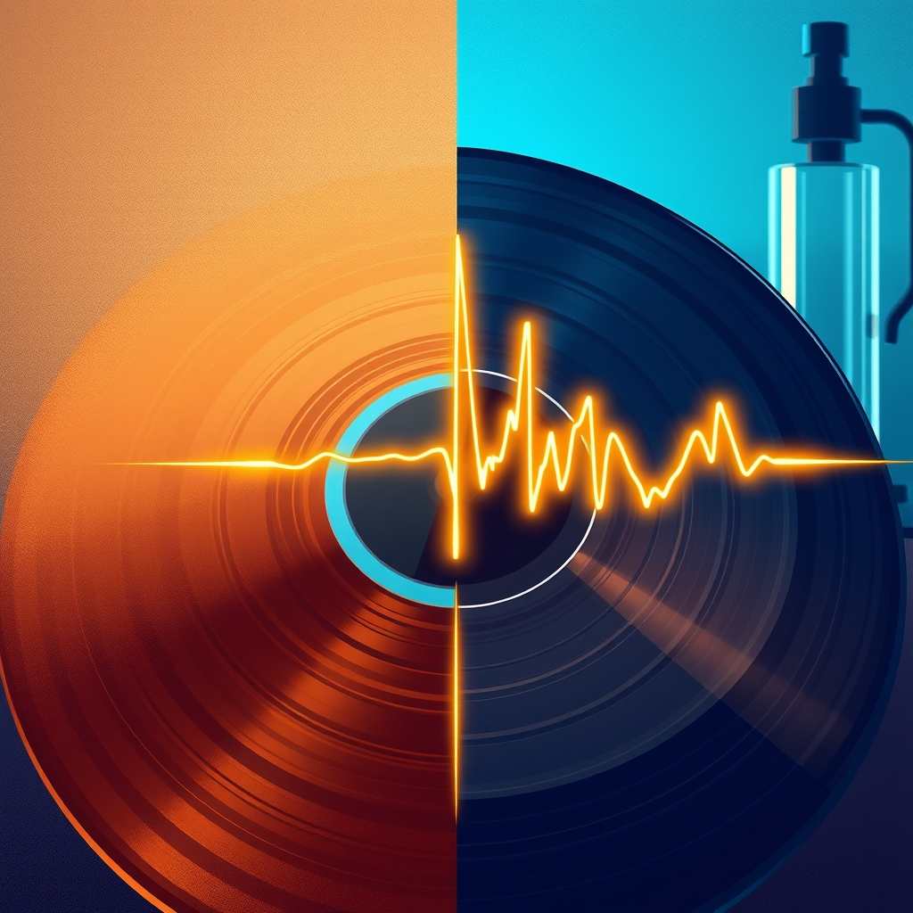

[Home](../index.md) > [Reflections](./index.md) | [⏮️](./2024-11-27.md) [⏭️](./2024-12-02.md)  
# 2024-12-01 |  🎶🔬 Is Music Getting Worse?  
  
## 📺 Videos  
[📉🎶👎 The Real Reason Why Music Is Getting Worse](../videos/the-real-reason-why-music-is-getting-worse.md)