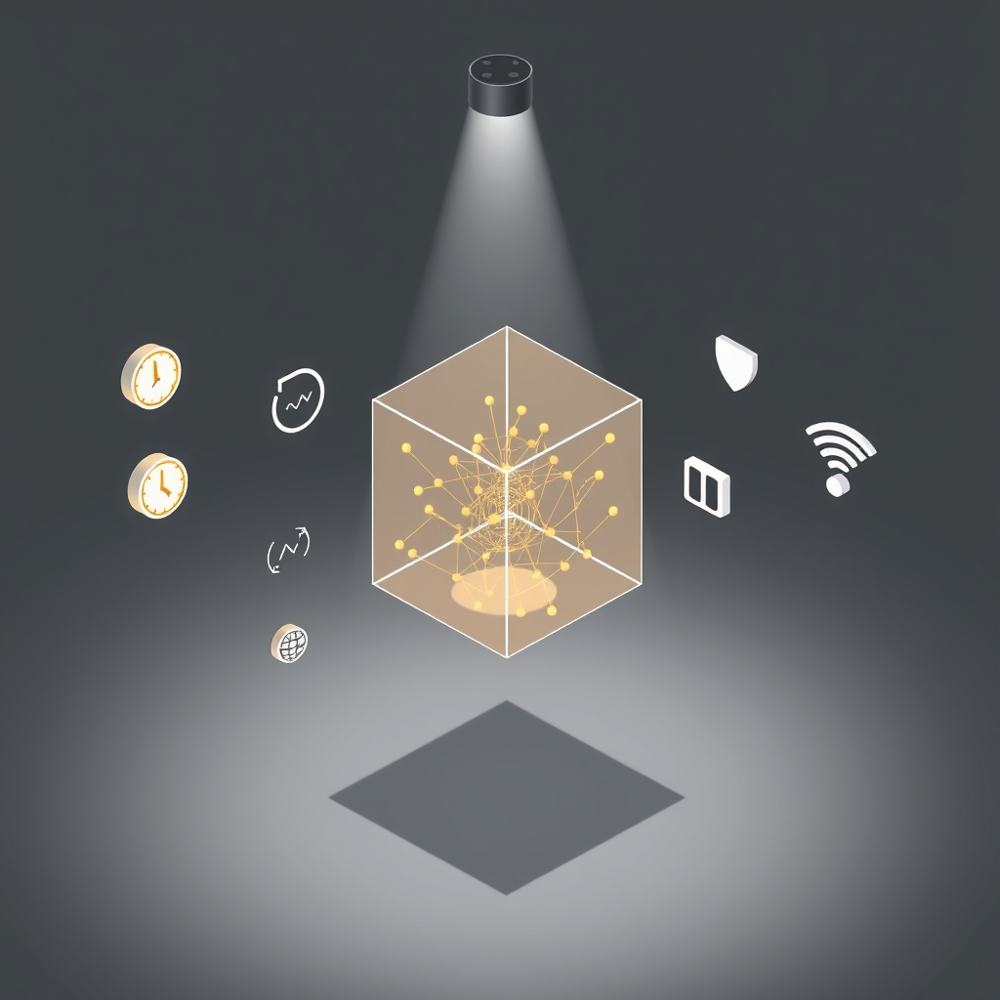

[Home](../index.md) > [Reflections](./index.md) | [⏮️](./2024-12-02.md) [⏭️](./2024-12-05.md)  
# 2024-12-03 | 🔒 Private AI 🤖  
  
## 💡 Product Idea  
This is an incomplete draft... Like most everything on my website 😁  
  
- 🤔 Cause and effect is hard.  
- 🧪 Science can help.  
- 📊 Data collection is tedious.  
- 🤯 Analysis is non trivial.  
- 🛠️ I want a tool  
  - ✨ that makes rigorous data collection and analysis easy  
  - 🆓 that is free and open source  
  - ⚙️ that leverages the technology, data, and systems around me  
  - 🔒 that allows me to own and control my own data  
- 🔬 I want to form a hypothesis, design an experiment, collect and analyze data, and draw conclusions with little to no effort and lots of rigor  
- 📢 I want to easily share my results on platforms I already use  
  
### 💡 Hypothesis  
A tool sufficiently close to what I'm looking for doesn't exist.  
  
### 🗺️ Plan  
1. 🔍 Research existing products in an attempt to disprove my non-existence hypothesis.  
    1. ✅ If the tool already exists, I'll try it out.  
    2. 🏗️ If not, I'll start an effort to build it.  
  
### 📝 Description  
1. 🔓 Free & Open Source  
2. 📱 Available on all of my devices  
    1. 🌐 Progressive Web App  
3. 📑 Uses open standards and formats when they are sufficient  
4. 🧩 Tools and data are decoupled   
    1. ✍️ Collection tools can write to any file  
    2. 📈 Visualization and analysis tools can read from any source and render in any format  
  
### 🧪 Examples  
- ⏱️ I want to track my time and activities with zero effort, explore the data, identify trends, and experiment with changes.  
  - 📱 My phone is nearly always on me with many sensors collecting or able to collect data.  
  - ⌚ I wear a Fitbit  
  - 💻 I work on a computer all day  
  - 💡 Without changing anything, I should have access to plenty of data to give a very thorough description of where I am and what I'm doing all day.  
  - 🗓️ I want to see a timeline of events.  
  - 🧠 With some subjective input from me, I should be able to turn objective but inconclusive events into fairly accurate activity predictions.  
  - 🚗 For example, if my phone is connected to my car's Bluetooth receiver, and my GPS location is not at home, I'm pretty sure that I'm driving my car. Using the connect and disconnect Bluetooth events after the fact, I can tell when I start and stop my car.  
  - 🔔 If an alert were to pop up on my phone several times per day and ask where I am and what I'm doing, it shouldn't take long to use nearby cell tower IDs, Wi-Fi access points, and Bluetooth devices to predict where I am and what I'm doing.  
  - 😊 If I had an occasional notification collecting my mood and rationale, I should be able to use collected data and correlations to predict my mood.  
  - 🤔 Maybe I can ask my data: why am I tired right now?  
  - 🤖 And maybe it could reply: probably because you exercised more than usual this morning and are currently late for lunch.  
  - 😴 Oh, and maybe the trend of slowly accumulating sleep debt over the past week is also a contributing factor. Maybe a higher than usual ambient noise level is distracting, causing increased effort to focus, which depletes energy levels faster.  
  - 🎧 Maybe put on some noise canceling headphones or work in a quieter space.  
  - ✨ Based on previous trends and our latest working theories about motivation and energy levels, if you'd gotten another 45 minutes of sleep over the past 3 days, this probably wouldn't feel as taxing.  
- 🤖 While we're at it, maybe my data can help automate some routine tasks.  
  - 📅 When I have a calendar event at a different location, I tend to create another calendar event on each side for driving to and from.  
    - 🧩 With a bit of data and integration work, maybe we can automatically create those supporting events and save me a bit of time.  
    - 📝 Maybe if I record what I bring where and why, my data can be pivotal in helping to plan my day proactively.  
  
### 📝 Summary  
- 🤔 I want a personal assistant  
  - ⚙️ with access to all my tools and data  
  - 🤝 who doesn't have conflicts of interest  
  - 👁️ with precise, accurate observation skills  
  - 📈 with scientific, statistical, and analytical skills  
  - 🧠 who records and analyze everything in order to help me understand, plan, and manage my life  
  
## 🦋 Bluesky    
<blockquote class="bluesky-embed" data-bluesky-uri="at://did:plc:i4yli6h7x2uoj7acxunww2fc/app.bsky.feed.post/3mozs3aytag24" data-bluesky-cid="bafyreicbbiiijqjlwqfhjmylwjlvxuzfbroiuy6kwwar2bvy6xorpjpksu">
2024-12-03 | 🔒 Private AI 🤖  
  
#AI Q: 📊 Would you trust a personal AI with your private life data?  
  
🧪 Hypothesis Testing | 📈 Quantified Self | 🔓 Open Source Software | 🧠 Digital  
https://bagrounds.org/reflections/2024-12-03
&mdash; <a href="https://bsky.app/profile/did:plc:i4yli6h7x2uoj7acxunww2fc?ref_src=embed">Bryan Grounds (@bagrounds.bsky.social)</a> <a href="https://bsky.app/profile/did:plc:i4yli6h7x2uoj7acxunww2fc/post/3mozs3aytag24?ref_src=embed">2026-06-24T11:16:39.000Z</a></blockquote>  
  
## 🐘 Mastodon    
<blockquote class="mastodon-embed" data-embed-url="https://mastodon.social/@bagrounds/116819920353237962/embed" style="background: #282c37; border-radius: 8px; border: 1px solid #393f4f; margin: 0; max-width: 540px; min-width: 270px; overflow: hidden; padding: 0;"> <a href="https://mastodon.social/@bagrounds/116819920353237962" target="_blank" style="align-items: center; color: #d9e1e8; display: flex; flex-direction: column; font-family: system-ui, -apple-system, BlinkMacSystemFont, 'Segoe UI', Oxygen, Ubuntu, Cantarell, 'Fira Sans', 'Droid Sans', 'Helvetica Neue', Roboto, sans-serif; font-size: 14px; justify-content: center; letter-spacing: 0.25px; line-height: 20px; padding: 24px; text-decoration: none;"> <svg xmlns="http://www.w3.org/2000/svg" xmlns:xlink="http://www.w3.org/1999/xlink" width="32" height="32" viewBox="0 0 79 75"><path d="M63 45.3v-20c0-4.1-1-7.3-3.2-9.7-2.1-2.4-5-3.7-8.5-3.7-4.1 0-7.2 1.6-9.3 4.7l-2 3.3-2-3.3c-2-3.1-5.1-4.7-9.2-4.7-3.5 0-6.4 1.3-8.6 3.7-2.1 2.4-3.1 5.6-3.1 9.7v20h8V25.9c0-4.1 1.7-6.2 5.2-6.2 3.8 0 5.8 2.5 5.8 7.4V37.7H44V27.1c0-4.9 1.9-7.4 5.8-7.4 3.5 0 5.2 2.1 5.2 6.2V45.3h8ZM74.7 16.6c.6 6 .1 15.7.1 17.3 0 .5-.1 4.8-.1 5.3-.7 11.5-8 16-15.6 17.5-.1 0-.2 0-.3 0-4.9 1-10 1.2-14.9 1.4-1.2 0-2.4 0-3.6 0-4.8 0-9.7-.6-14.4-1.7-.1 0-.1 0-.1 0s-.1 0-.1 0 0 .1 0 .1 0 0 0 0c.1 1.6.4 3.1 1 4.5.6 1.7 2.9 5.7 11.4 5.7 5 0 9.9-.6 14.8-1.7 0 0 0 0 0 0 .1 0 .1 0 .1 0 0 .1 0 .1 0 .1.1 0 .1 0 .1.1v5.6s0 .1-.1.1c0 0 0 0 0 .1-1.6 1.1-3.7 1.7-5.6 2.3-.8.3-1.6.5-2.4.7-7.5 1.7-15.4 1.3-22.7-1.2-6.8-2.4-13.8-8.2-15.5-15.2-.9-3.8-1.6-7.6-1.9-11.5-.6-5.8-.6-11.7-.8-17.5C3.9 24.5 4 20 4.9 16 6.7 7.9 14.1 2.2 22.3 1c1.4-.2 4.1-1 16.5-1h.1C51.4 0 56.7.8 58.1 1c8.4 1.2 15.5 7.5 16.6 15.6Z" fill="currentColor"/></svg> 
Post by @bagrounds@mastodon.social
 
View on Mastodon
 </a> </blockquote> 