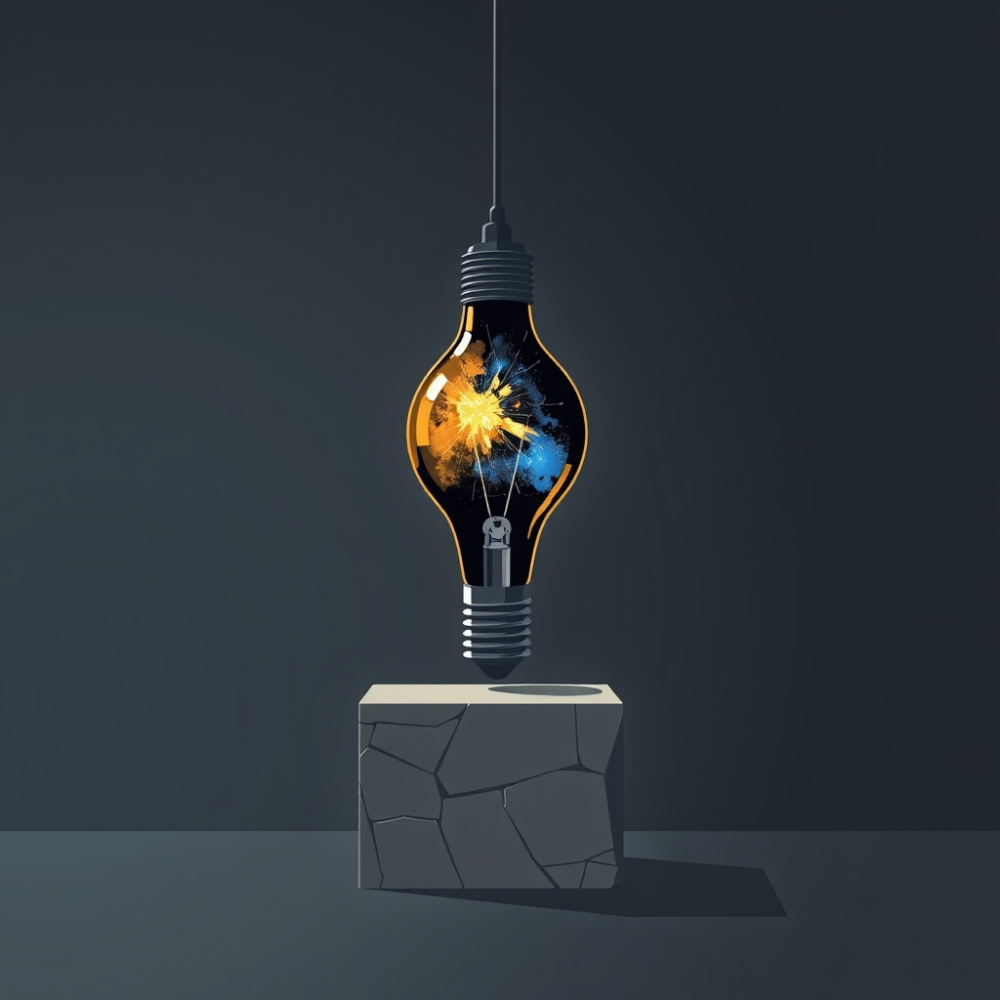

[Home](../index.md) > [Reflections](./index.md) | [⏮️](./2024-12-06.md) [⏭️](./2024-12-08.md)  
# 2024-12-07 | 💡 Innovation 📖  
  
## 🧠 Education  
[💡🤖💰💥🏢📉 The Innovator's Dilemma: When New Technologies Cause Great Firms to Fail](../books/the-innovators-dilemma.md)  
