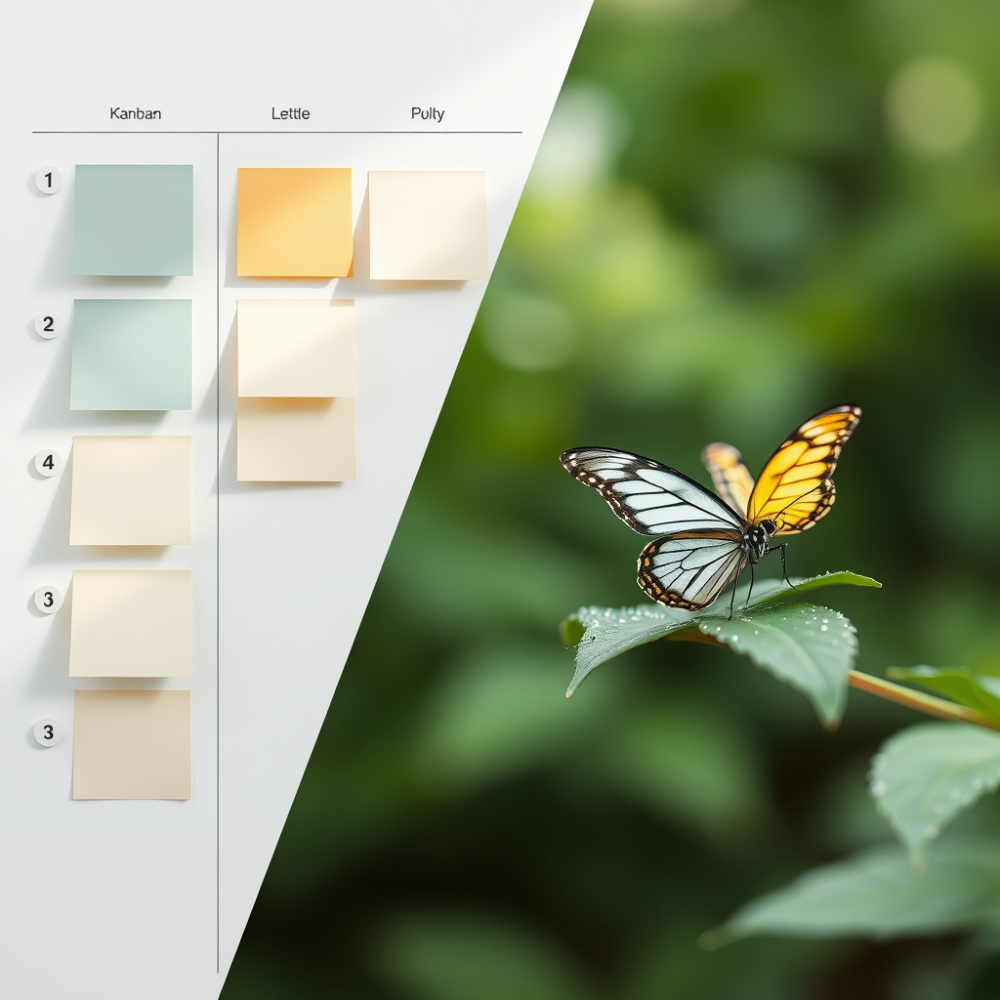

[Home](../index.md) > [Reflections](./index.md) | [⏮️](./2024-12-07.md) [⏭️](./2024-12-09.md)  
# 2024-12-08 | 📌 Kanban ✅ | 🦋 Nature 👀  
  
## 💡 Idea  
- [Kanban for Home: A Simple Workflow Strategy for the Whole Family](https://parentlightly.com/kanban-for-home)  
  
## 🌌 New Topic  
- [iNaturalist](../topics/inaturalist.md)  
  
## 🦋 Bluesky    
<blockquote class="bluesky-embed" data-bluesky-uri="at://did:plc:i4yli6h7x2uoj7acxunww2fc/app.bsky.feed.post/3mr4u5dezwq2i" data-bluesky-cid="bafyreig4lzz42udmyu3xdjilfkrddsblkhl3rlitxqw3vgud2xu7f42fxe">
2024-12-08 | 📌 Kanban ✅ | 🦋 Nature 👀  
  
#AI Q: 📋 Could a kanban board improve your home life?  
  
🏡 Home Management | 🌿 Biodiversity | 🔭 Citizen Science  
https://bagrounds.org/reflections/2024-12-08
&mdash; <a href="https://bsky.app/profile/did:plc:i4yli6h7x2uoj7acxunww2fc?ref_src=embed">Bryan Grounds (@bagrounds.bsky.social)</a> <a href="https://bsky.app/profile/did:plc:i4yli6h7x2uoj7acxunww2fc/post/3mr4u5dezwq2i?ref_src=embed">2026-07-21T03:21:58.000Z</a></blockquote>