[Home](../index.md) > [Reflections](./index.md) | [⏮️](./2024-12-09.md) [⏭️](./2024-12-12.md)  
# 2024-12-10  
## 😮😊 A Surprisingly Good Day  
🤔 Why did I have a good day after a poor night's sleep?  
  
### 🎮☕📈 Control, Motivation, and Performance  
- What if self awareness, evaluation, and control are good for performance, but bad for motivation?  
- Maybe the positive feedback loop between motivation and performance can dominate the effect of control on motivation.  

```mermaid  
graph TD  
    A[👀 Self Awareness]  
    E[📏 Self Evaluation]  
    C[🎮 Self Control]  
    M[☕ Motivation]  
    P[📈 Performance]  
    A -->|🟩➕| C  
    A -->|🟩➕| E  
    A -->|🟥➖| M  
    E -->|🟩➕| C  
    E -->|🟥➖| M  
    M -->|🟩➕| P  
    P -->|🟩➕| M  
    C -->|🟩➕| P  
    C -->|🟥➖| M  
```  
  

  
### 😴 Sleep, Motivation, and Control  
Then sleep deprevation may  
- indirectly decrease performance through decreased control  
- but the decreased observation, awareness, and control may increase motivation, which increases performance, which increases motivation  

```mermaid  
graph TD  
    S[😴 Sleep]  
    A[👀 Self Awareness]  
    E[📏 Self Evaluation]  
    C[🎮 Self Control]  
    M[☕ Motivation]  
    P[📈 Performance]  
    S -->|🟩➕| A  
    S -->|🟩➕| E  
    S -->|🟩➕| C  
    S -->|🟩➕| M  
    A -->|🟩➕| C  
    A -->|🟩➕| E  
    A -->|🟥➖| M  
    E -->|🟩➕| C  
    E -->|🟥➖| M  
    M -->|🟩➕| P  
    P -->|🟩➕| M  
    C -->|🟩➕| P  
    C -->|🟥➖| M  
```  
  

  
### 🎵 Music, Motivation, and Control  
Good music may decrease awareness, evaluation, and control, indirectly increasing motivation **and** increase motivation directly, yielding a powerful motivation boost.  
  

  
### 🪞 Reflections  
- Maybe focusing too much on self awareness, evaluation, and control can result in a negative impact on motivation, which feeds a vicious cycle with performance.  
- Self awareness and evaluation are necessary for course correction, but too much may be crippling for motivation.  
- Systems thinking points to the existence of leverage points in complex systems.   
  - Of course, we want to find the leverage points  
  - and often we do  
  - but it's easy to find the lever and push in the wrong direction  
- Maybe self control is a lever that I've been pushing too hard.  
- Maybe if I relax a bit, I can be less reactive to the noisy signal of performance and take a more gradual, gentler approach to control.  
- Control decreases motivation; use with caution.  
- Music is great for motivation.  
- Mood -> motivation -> performance  
- Maybe this explains a bit about Micromanagement  
  - It's very tempting as a means of control  
  - But it's very demotivating, resulting in poor outcomes in the long run  
- Maybe this also explains that weird observation in psychology where short term sleep deprevation can alleviate symptoms of depression  
  - perhaps the sleep deprevation turns off the prefrontal cortex, which results in less self criticism and the harsh resultung impact on motivation and mood  
