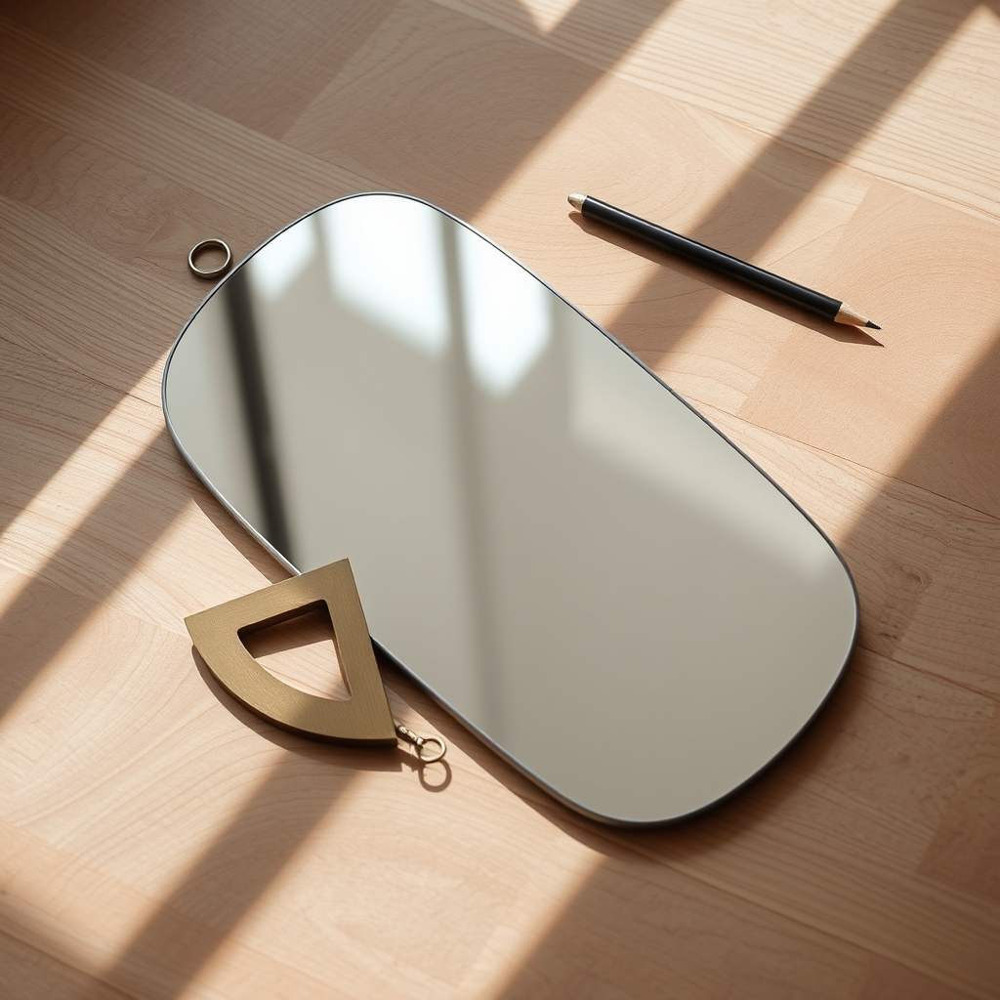

[Home](../index.md) > [Reflections](./index.md) | [⏮️](./2024-12-10.md) [⏭️](./2024-12-14.md)  
# 2024-12-12 | 🪞 Introspect 📐  
  
- [📊🧐📝⚙️ Design a Performance Self-Evaluation System](../topics/design-a-performance-self-evaluation-system.md)