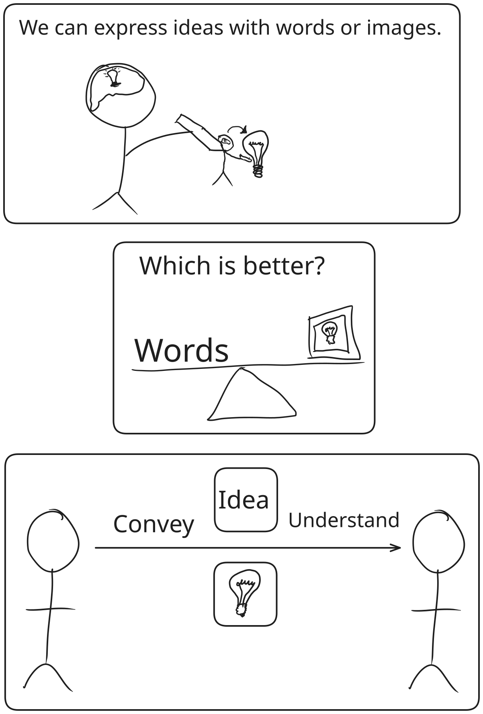

[Home](../index.md) > [Reflections](./index.md) | [⏮️](./2024-12-12.md) [⏭️](./2024-12-15.md)  
# 2024-12-14 | 📃 Illustrate 🖼️  
  
## 📃 Words ⚔️ vs 🖼️ Images  
  
%%[🖋 Edit in Excalidraw](../../words-vs-images.md)%%  
  
### 🪞 Reflections  
- 🖼️ I like the drawings  
- 🔎 The text isn't searchable  
  - 💡 but in principle, I believe the text embedded in an 🌐 SVG 🧐 should be able to be 🔍 searchable... 🤔 I may just need to ⚙️ figure out how.  
  
## 🧠 Education  
- [Systems Thinking Course - Lesson 03 - Pillar 2: Communication](../videos/systems-thinking-course-lesson-03-pillar-2-communication.md)  
  
## 🦋 Bluesky    
<blockquote class="bluesky-embed" data-bluesky-uri="at://did:plc:i4yli6h7x2uoj7acxunww2fc/app.bsky.feed.post/3mssjbrvjvk2i" data-bluesky-cid="bafyreiaevywme6mfakfdspmq5kujtuhyw4yiixtceob4vu3k5pe35wbqlq">
2024-12-14 | 📃 Illustrate 🖼️  
  
#AI Q: 🎨 Do visuals explain complex ideas better than words?  
  
? Yes.  
https://bagrounds.org/reflections/2024-12-14
&mdash; <a href="https://bsky.app/profile/did:plc:i4yli6h7x2uoj7acxunww2fc?ref_src=embed">Bryan Grounds (@bagrounds.bsky.social)</a> <a href="https://bsky.app/profile/did:plc:i4yli6h7x2uoj7acxunww2fc/post/3mssjbrvjvk2i?ref_src=embed">2026-08-11T11:31:22.000Z</a></blockquote>