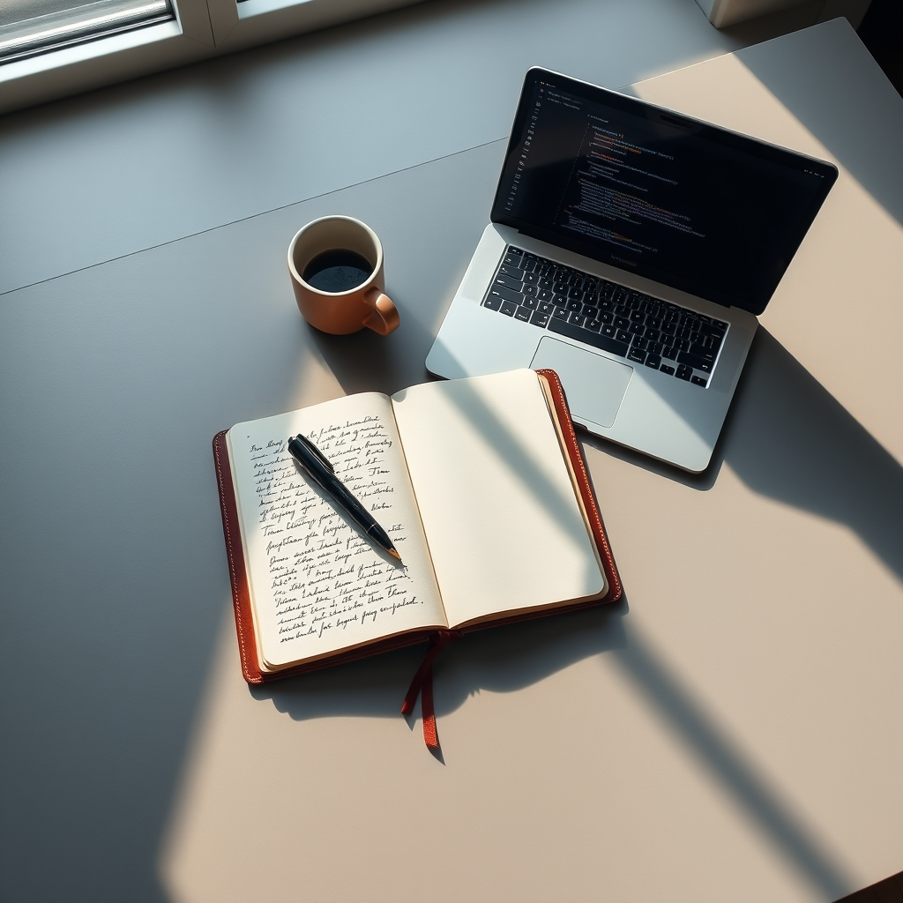

[Home](../index.md) > [Reflections](./index.md) | [⏮️](./2024-12-15.md) [⏭️](./2024-12-21.md)  
# 2024-12-16 | 📒 Script 💻  
  
## 🎦 Videos  
- [This Journal Keeps Me Productive (& Maybe You Too)](../videos/this-journal-keeps-me-productive-and-maybe-you-too.md)  
- [2025 Yearly Themes](../videos/2025-yearly-themes.md)  
- [Spaceship You](../videos/spaceship-you.md)  
- [You Are Two](../videos/you-are-two.md)  
- [What Are You?](../videos/what-are-you.md)  
  
## 🤖 Automation  
- https://github.com/sundevista/youtube-template  
  
## 🤖💬 Bot Chats  
- [Obsidian Templater Filename Sanitization](../bot-chats/obsidian-templater-filename-sanitization.md)  
