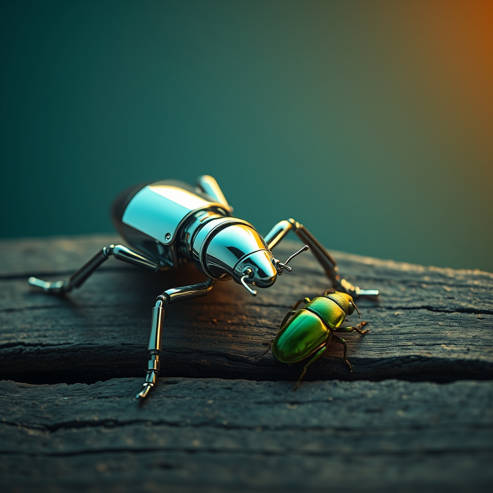

[Home](../index.md) > [Reflections](./index.md) | [⏮️](./2024-12-24.md) [⏭️](./2024-12-29.md)  
# 2024-12-28 | 🤖 Bots | 🐛 Bugs  
  
## 🤖 Bot Chats  
- [Android Local LLMs](../bot-chats/android-local-llms.md)  
  
## 🤔 Naming  
- 💡 I'm thinking about making a new section of my website for 🐛 bug descriptions  
- 🤔 And I kinda want a cool name for it  
- 🤓 maybe 🔍 Entomology: the study of 🐜 insects  
- 🐝 but also maybe something like 🍯 apiary: a collection of 🐝 bees (🐛 bugs that sting) ❓  
  
## 🌌 Topics  
- [Maximizing AI Leverage](../topics/maximizing-ai-leverage.md)