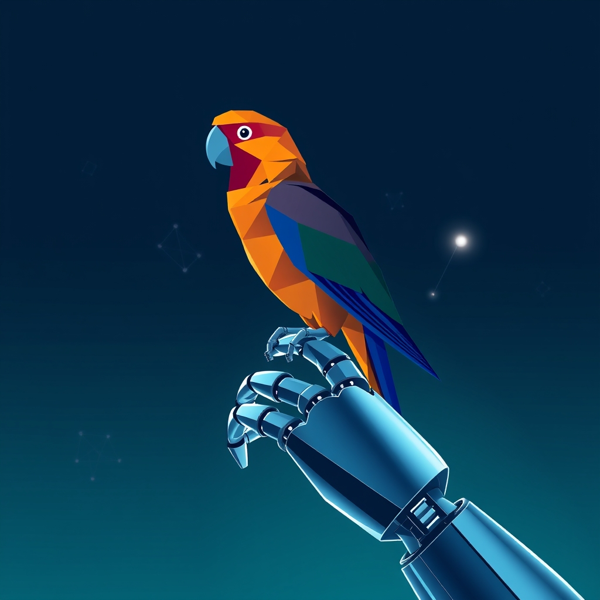

[Home](../index.md) > [Reflections](./index.md) | [⏮️](./2024-12-28.md) [⏭️](./2025-01-12.md)  
# 2024-12-29 | 🤖 [LLMs](../topics/large-language-models.md) 🦜  
  
- [How Much Wood](../bot-chats/how-much-wood.md)  
- [Experts are STUNNED! Meta's NEW LLM Architecture is a GAME-CHANGER!](../videos/experts-are-stunned-metas-new-llm-architecture-is-a-game-changer.md)  
- [You Don’t Understand How Language Works](../videos/you-dont-understand-how-language-works.md)  
- [Maximizing AI Leverage](../topics/maximizing-ai-leverage.md)  
- [Anthropic MCP + Ollama. No Claude Needed? Check it out!](../videos/anthropic-mcp-ollama-no-claude-needed-check-it-out.md)