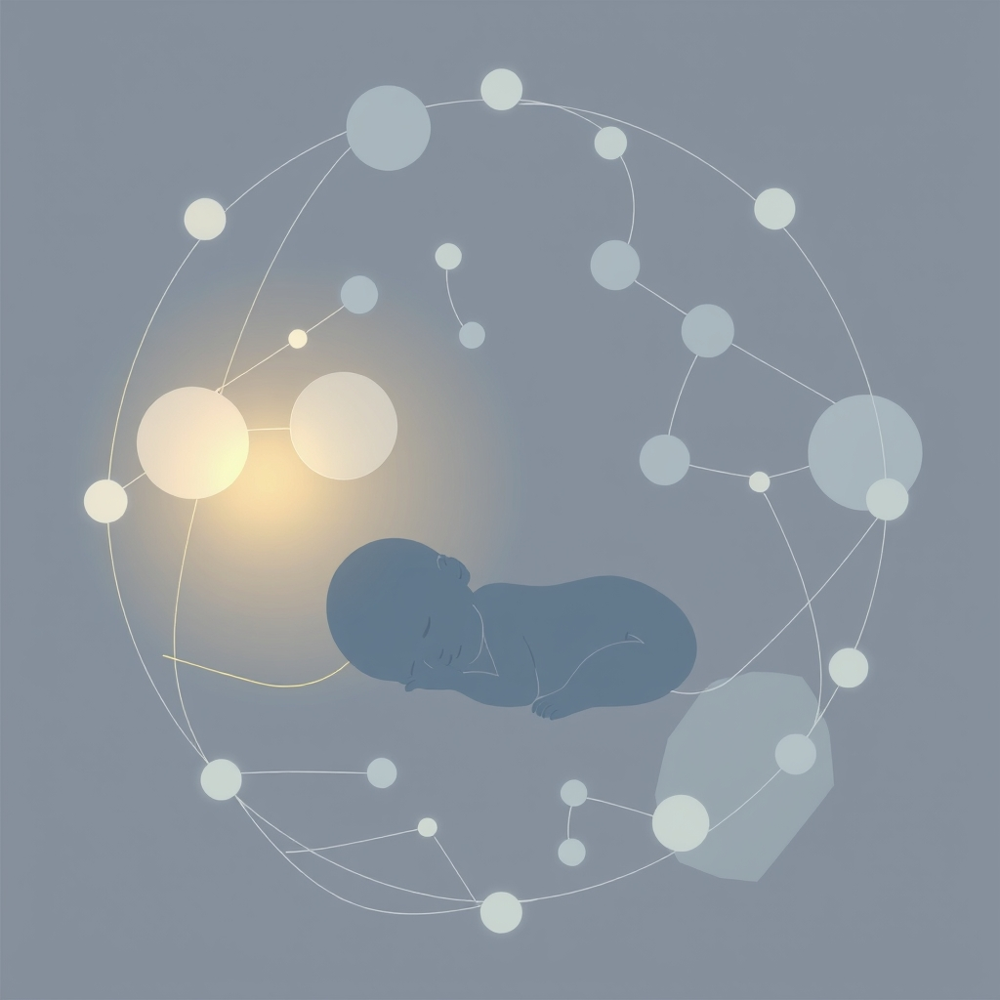

[Home](../index.md) > [Reflections](./index.md) | [⏮️](./2025-01-12.md) [⏭️](./2025-02-04.md)  
# 2025-02-02 | 👶 Soothing | 🧬 Synthesis  
  
- Started [👶😊😴 The Happiest Baby on the Block: The New Way to Calm Crying and Help Your Newborn Baby Sleep Longer](../books/the-happiest-baby-on-the-block.md)  
- Added AI Summary for [Russell L Ackoff From Mechanistic to Systemic Thinking](../videos/russell-l-ackoff-from-mechanistic-to-systemic-thinking.md)  
