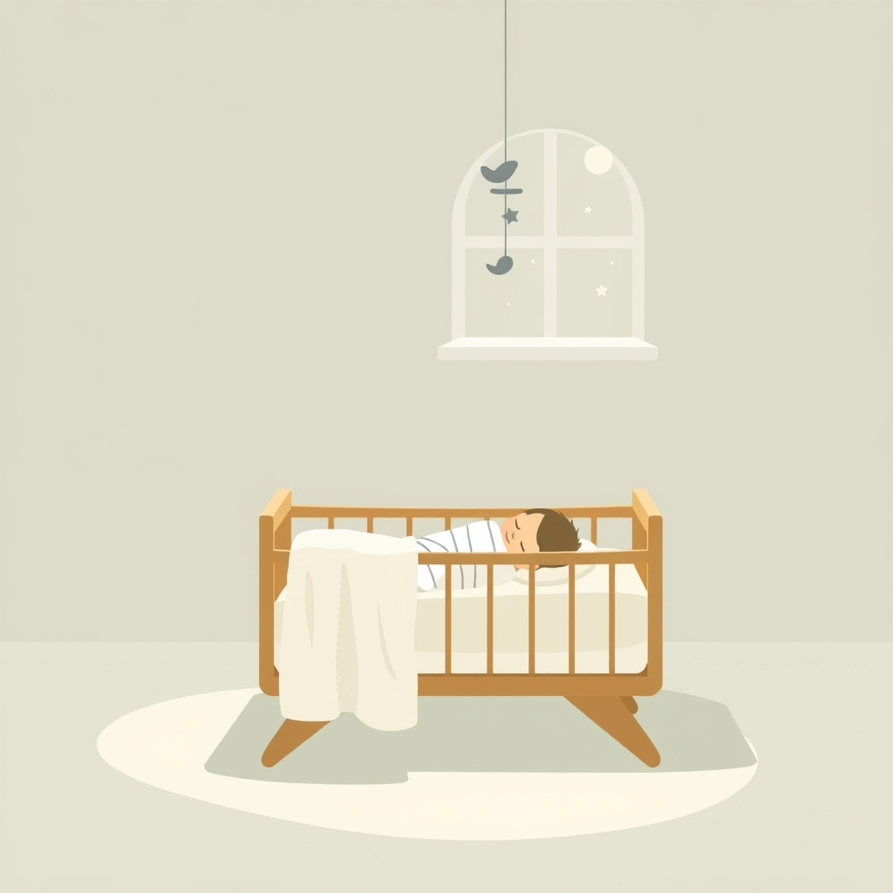

[Home](../index.md) > [Reflections](./index.md) | [⏮️](./2025-02-02.md) [⏭️](./2025-02-15.md)  
# 2025-02-04 | 👶 Happiest 🤫  
  
- [The Happiest Baby on the Block - Harvey Karp (Summary)](../videos/the-happiest-baby-on-the-block-harvey-karp-summary.md)