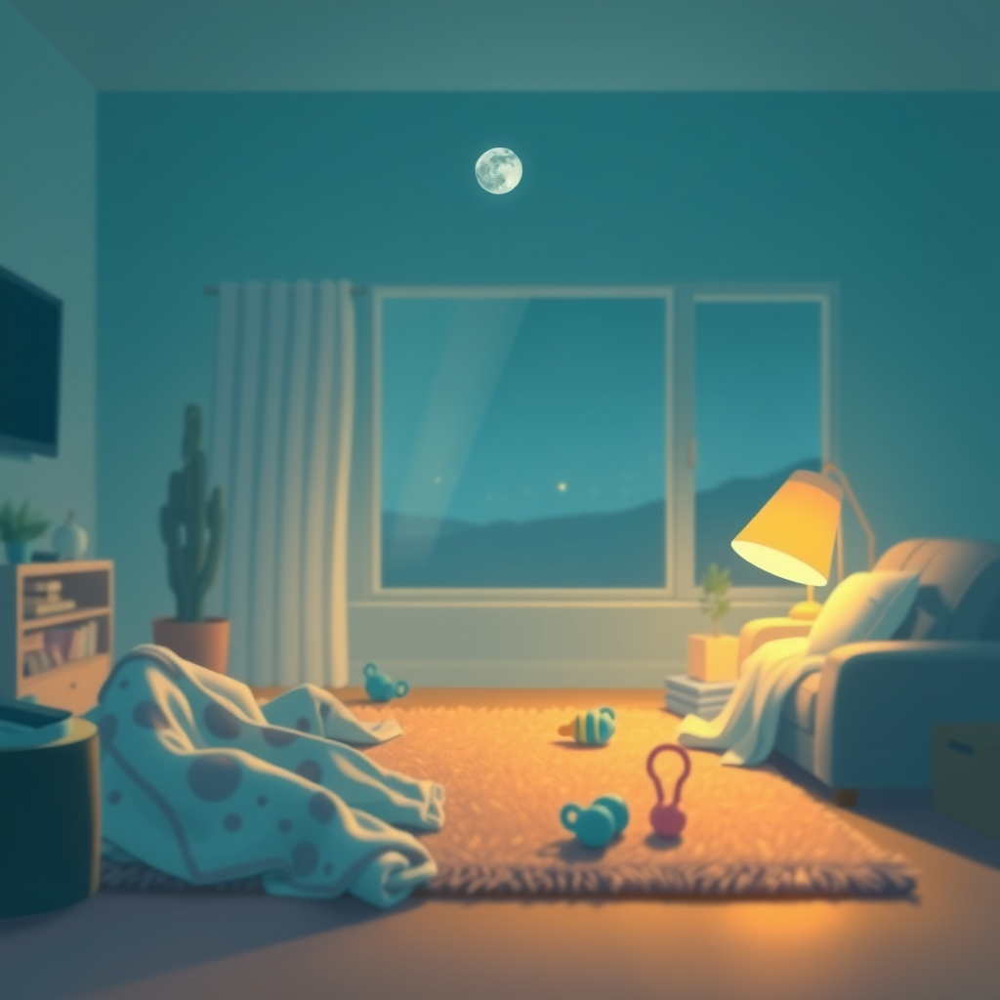

[Home](../index.md) > [Reflections](./index.md) | [⏮️](./2025-02-04.md) [⏭️](./2025-02-17.md)  
# 2025-02-15 | 🧹🏠 Drifting  👶💤  
  
- [🧹🌊😵‍💫 How to Keep House While Drowning: A Gentle Approach to Cleaning and Organizing](../books/how-to-keep-house-while-drowning.md)  
- 👶 [Pediatrician's Top Tips For Newborn Sleep](../videos/pediatricians-top-tips-for-newborn-sleep.md)