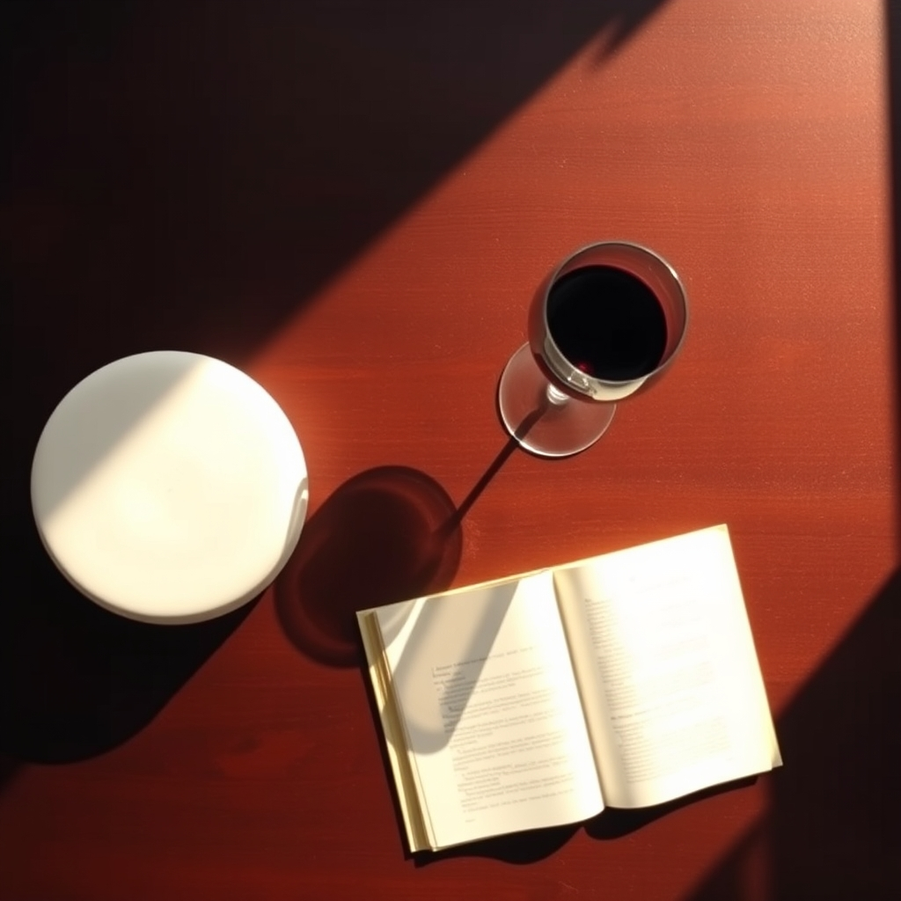

[Home](../index.md) > [Reflections](./index.md) | [⏮️](./2025-02-17.md) [⏭️](./2025-02-22.md)  
# 2025-02-21 | 🧠 Min🧘ful 🍷  
  
[🧘‍♀️ Full 💥 Catastrophe 🏠 Living](../books/full-catastrophe-living.md)