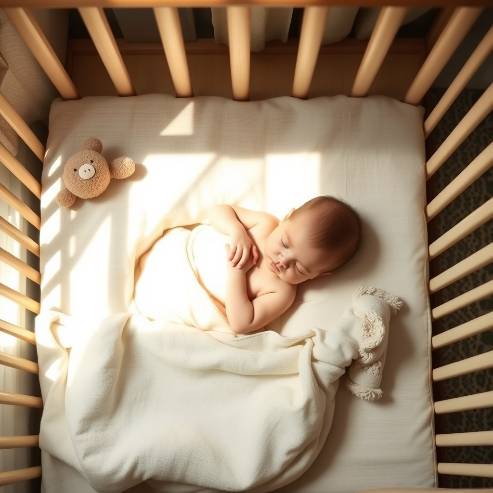

[Home](../index.md) > [Reflections](./index.md) | [⏮️](./2025-02-21.md) [⏭️](./2025-02-23.md)  
# 2025-02-22 | 😴 Sleeping 🛏️ Babies 👶  
  
- [Parenting Resources Recommendations](../bot-chats/parenting-resources-recommendations.md)  
- [Co-Sleeping With Infants: Science, Public Policy, and Parents Civil Rights, with James McKenna, PhD](../videos/co-sleeping-with-infants-science-public-policy-and-parents-civil-rights-with-james-mckenna-phd.md)  
- [Safe Sleep for Breastfeeding Babies](../articles/safe-sleep-for-breastfeeding-babies.md)  
- [Infant Cosleeping with James McKenna, PhD](../videos/infant-cosleeping-with-james-mckenna-phd.md)