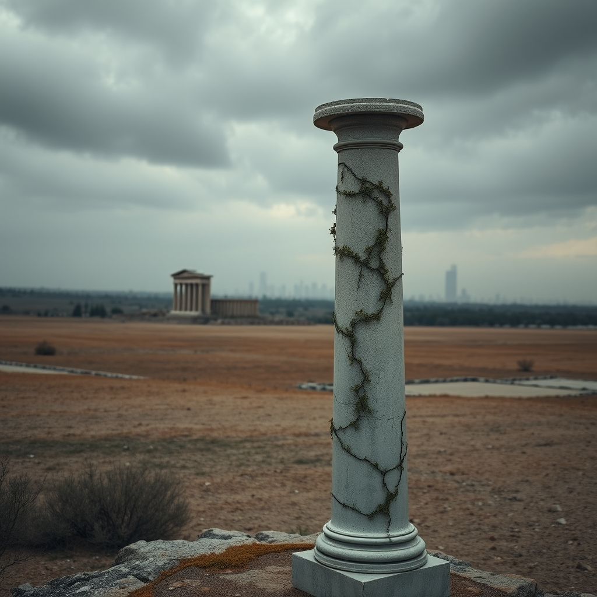

[Home](../index.md) > [Reflections](./index.md) | [⏮️](./2025-02-24.md) [⏭️](./2025-02-28.md)  
# 2025-02-26 | 🏛️ Decline 📉  
  
- [Is Every Civilization Doomed to Fail? - Gregory Aldrete](../videos/is-every-civilization-doomed-to-fail-gregory-aldrete.md)  
- [How the Elite rigged Society (and why it’s falling apart) | David Brooks](../videos/how-the-elite-rigged-society-and-why-it-s-falling-apart-david-brooks.md)  
