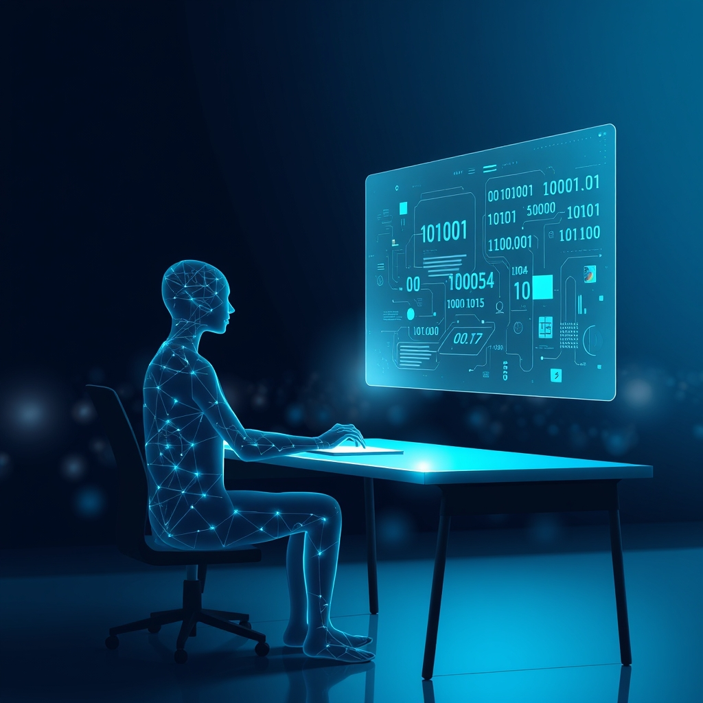

[Home](../index.md) > [Reflections](./index.md) | [⏮️](./2025-02-26.md) [⏭️](./2025-03-01.md)  
# 2025-02-28 | 💬 ChatBots 🤖  
  
- https://blog.google/technology/developers/gemini-code-assist-free  
- [How I use LLMs](../videos/how-i-use-llms.md)  
