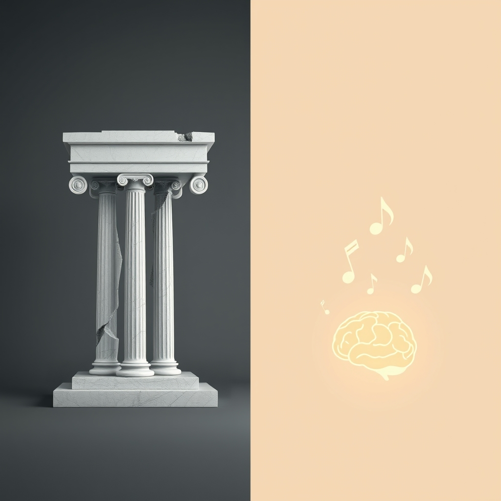

[Home](../index.md) > [Reflections](./index.md) | [⏮️](./2025-02-28.md) [⏭️](./2025-03-03.md)  
# 2025-03-01 | 🏛️💔 Transgressions | 👶 Baby 🧠 Brains  
  
- [Rep. Aime Wichtendahl testifies as Iowa removes civil rights for trans people (Feb 27, 2025)](../videos/rep-aime-wichtendahl-testifies-as-iowa-removes-civil-rights-for-trans-people-feb-27-2025.md)  
    - [Iowa gives final approval to a bill removing gender identity protections despite protests](../articles/iowa-gives-final-approval-to-a-bill-removing-gender-identity-protections-despite-protests.md)  
    - [🏳️‍⚧️📜🌱✊ Transgender History: The Roots of Today's Revolution](../books/transgender-history.md)  
    - [⚧️👑🏰 The Transsexual Empire](../books/the-transsexual-empire.md)  
- [Learn how to boost your baby's brain from a Harvard Professor | UNICEF](../videos/learn-how-to-boost-your-baby-s-brain-from-a-harvard-professor-unicef.md)  
- [Musical intervention enhances infants’ neural processing of temporal structure in music and speech](../articles/musical-intervention-enhances-infants-neural-processing-of-temporal-structure-in-music-and-speech.md)  
- [Parenting and Infant Development Guide](../bot-chats/parenting-and-infant-development-guide.md)  
- [Effective Thought-Action Defusion Techniques](../bot-chats/effective-thought-action-defusion-techniques.md)