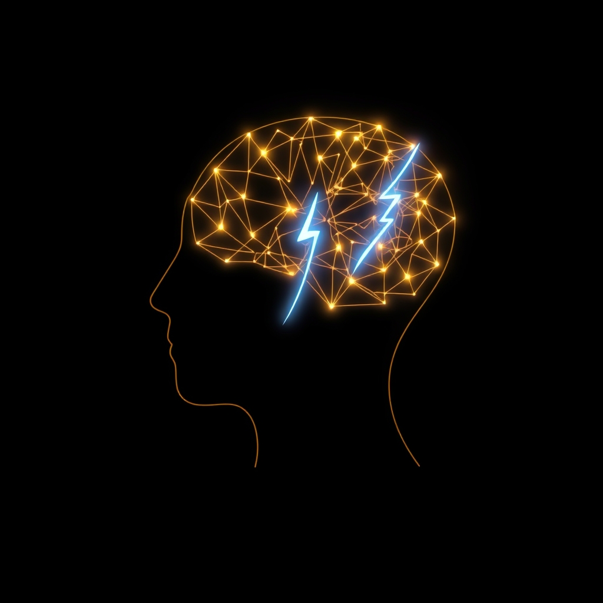

[Home](../index.md) > [Reflections](./index.md) | [⏮️](./2025-03-01.md) [⏭️](./2025-03-05.md)  
# 2025-03-03 | ⚡ Change 🧠 Minds  
  
## 📚 Books  
- [🙅‍♀️✂️⚖️ Never Split the Difference: Negotiating As If Your Life Depended On It](../books/never-split-the-difference.md)  
- [🍃🧠🤝🏼 Influence: The Psychology of Persuasion](../books/influence.md)  
- [🤝🐾 Rapport: The Four Ways to Read People](../books/rapport.md)  
- [🫂🤝🗣️ How To Win Friends And Influence People](../books/how-to-win-friends-and-influence-people.md)  
- [❤️🧠📈🤔 Emotional Intelligence: Why It Can Matter More Than IQ](../books/emotional-intelligence.md)  
- [👂🤫 Just Listen: Discover the Secret to Getting Through to Absolutely Anyone](../books/just-listen.md)  
- [🕊️🤝 Nonviolent Communication: A Language of Life](../books/nonviolent-communication.md)  
- [👑🎭♟️ The 48 Laws of Power](../books/the-48-laws-of-power.md)  
- [🎁➡️🏆 Give and Take: A Revolutionary Approach to Success](../books/give-and-take.md)  
- [🤔🐇🐢 Thinking, Fast and Slow](../books/thinking-fast-and-slow.md)  
- [🙉📢😵‍💫🔇 Noise: A Flaw in Human Judgment](../books/noise.md)  
- [👉🤏 Nudge: Improving Decisions about Health, Wealth, and Happiness](../books/nudge.md)  
- [🔮🤷🏼‍♀️🤪 Predictably Irrational, Revised and Expanded Edition: The Hidden Forces That Shape Our Decisions](../books/predictably-irrational.md)  
- [🌱🧘🏼‍♀️🏆 Mindset: The New Psychology of Success](../books/mindset.md)  
- [👶🌱📈 The Talent Code: Greatness Isn't Born. It's Grown. Here's How.](../books/the-talent-code.md)  
- [😇🧠 The Righteous Mind: Why Good People Are Divided by Politics and Religion](../books/the-righteous-mind.md)  
- [🧠🌐💡 The Extended Mind: The Power of Thinking Outside the Brain](../books/the-extended-mind.md)  
- [🤔🌍📈✅ Factfulness: Ten Reasons We're Wrong About the World - and Why Things Are Better Than You Think](../books/factfulness.md)