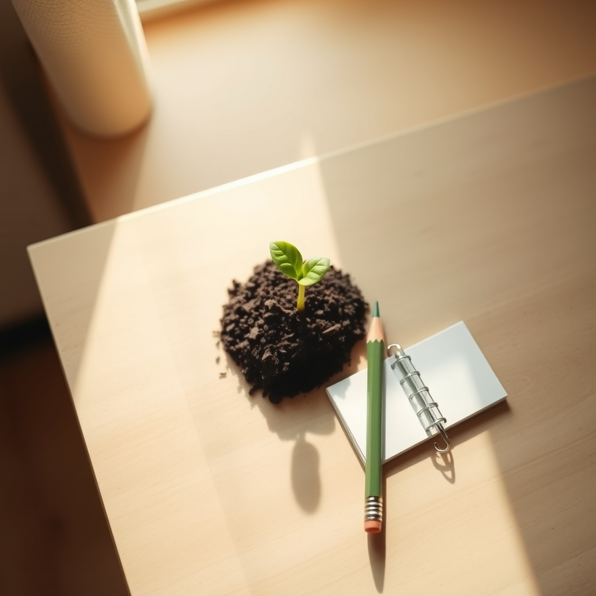

[Home](../index.md) > [Reflections](./index.md) | [⏮️](./2025-03-05.md) [⏭️](./2025-03-07.md)  
# 2025-03-06 | 🤏✨ Tiny Habits 🎯🌿  
  
## 📚 Books  
- [🤏♻️ Tiny Habits: The Small Changes That Change Everything](../books/tiny-habits.md)