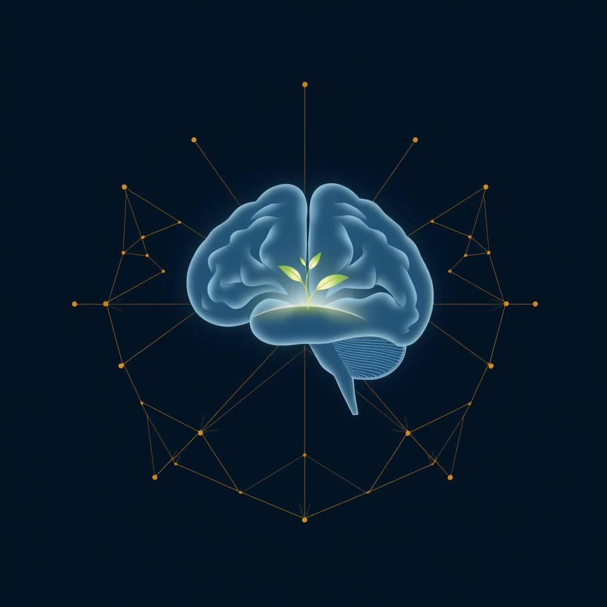

[Home](../index.md) > [Reflections](./index.md) | [⏮️](./2025-03-06.md) [⏭️](./2025-03-08.md)  
# 2025-03-07 | 👶 Babies | 🧠 Brains | 🌐 Systems  
  
## 📚 Books  
- [🧘 Indistractable: How to Control Your Attention and Choose Your Life](../books/indistractable.md)  
- [🤿💼 Deep Work: Rules for Focused Success in a Distracted World](../books/deep-work.md)  
- [⚛️🔄 Atomic Habits: An Easy & Proven Way to Build Good Habits & Break Bad Ones](../books/atomic-habits.md)  
- [🤔💪 Attention and effort](../books/attention.md)  
- [🧠🎯👁️💡 Applied Attention Theory](../books/human-attention.md)  
- [🏎️🦋🐿️✨ Driven to Distraction: Recognizing and Coping with Attention Deficit Disorder from Childhood Through Adulthood](../books/driven-to-distraction.md)  
- [👶⬆️👨‍💻📈 The Staff Engineer's Path](../books/the-staff-engineers-path.md)  
- [🎨🔄🧠🏢 The Fifth Discipline: The Art and Practice of the Learning Organization](../books/the-fifth-discipline.md)  
- [🌐🧭❓🔍🗺️ Complexity: A Guided Tour](../books/complexity.md)  
- [🦋🌀💥🤖 Nonlinear Dynamics and Chaos: With Applications to Physics, Biology, Chemistry, and Engineering](../books/nonlinear-dynamics-and-chaos.md)  
- [🌪️💥🦋🆕 Chaos: Making a New Science](../books/chaos.md)  
- [💥🌀➡️⏳⚖️🕰️ ️ Sync: How Order Emerges From Chaos In The Universe, Nature, And Daily Life](../books/sync.md)  
- [⛰️📈🥇 Peak: Secrets from the New Science of Expertise](../books/peak.md)  
- [🧠🔒 Make It Stick: The Science of Successful Learning](../books/make-it-stick.md)  
- [🧠📚🍎💡📝 How Learning Works: Eight Research-Based Principles for Smart Teaching](../books/how-learning-works.md)  
- [🧠🤔💡➡️ Cognitive Psychology and Its Implications](../books/cognitive-psychology-and-its-implications.md)  
- [🪖🎨 The War of Art: Break Through the Blocks and Win Your Inner Creative Battles](../books/the-war-of-art.md)  
- [🎨🙏✨ The Artist's Way: A Spiritual Path to Higher Creativity](../books/the-artists-way.md)  
- [👶🧠😊📈📚 Brain Rules for Baby: How to Raise a Smart and Happy Child from Zero to Five](../books/brain-rules-for-baby.md)  
- [🧠👶📈 Introduction to Developmental Cognitive Neuroscience: An Introduction](../books/developmental-cognitive-neuroscience.md)  
- [🎯👓🧠 Hyperfocus: How to Be More Productive in a World of Distraction](../books/hyperfocus.md)  
- [🤰👶🔬👩‍⚕️ 🧪 The Science of Mom: A Research-Based Guide to Your Baby's First Year](../books/the-science-of-mom.md)