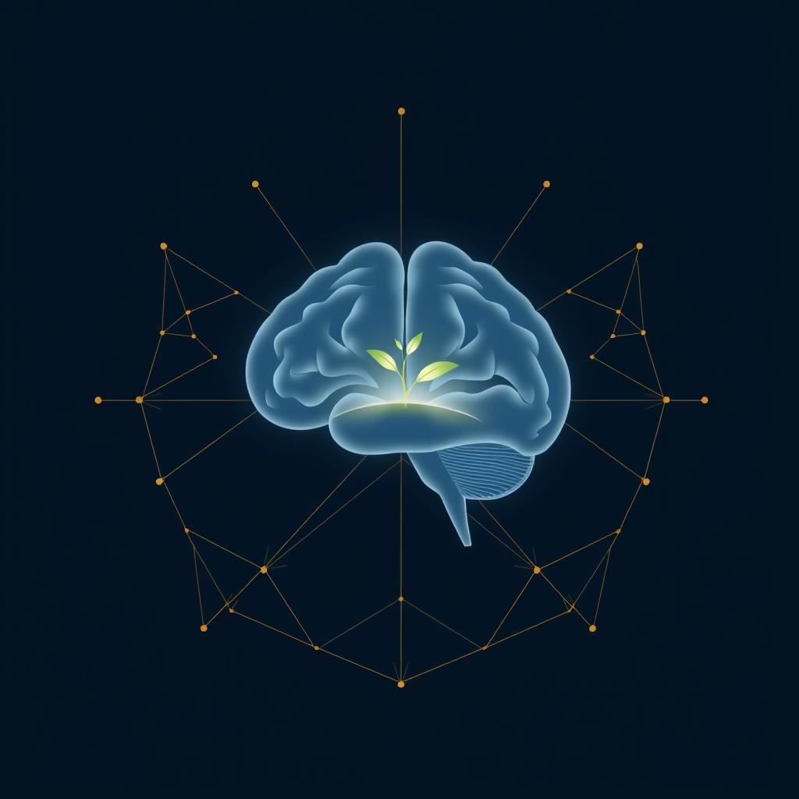

[Home](../index.md) > [Reflections](./index.md) | [⏮️](./2025-03-06.md) [⏭️](./2025-03-08.md)  
# 2025-03-07 | 👶 Babies | 🧠 Brains | 🌐 Systems  
  
## 📚 Books  
- [🧘 Indistractable: How to Control Your Attention and Choose Your Life](../books/indistractable.md)  
- [🤿💼 Deep Work: Rules for Focused Success in a Distracted World](../books/deep-work.md)  
- [⚛️🔄 Atomic Habits: An Easy & Proven Way to Build Good Habits & Break Bad Ones](../books/atomic-habits.md)  
- [🤔💪 Attention and effort](../books/attention.md)  
- [🧠🎯👁️💡 Applied Attention Theory](../books/human-attention.md)  
- [🏎️🦋🐿️✨ Driven to Distraction: Recognizing and Coping with Attention Deficit Disorder from Childhood Through Adulthood](../books/driven-to-distraction.md)  
- [👶⬆️👨‍💻📈 The Staff Engineer's Path](../books/the-staff-engineers-path.md)  
- [🎨🔄🧠🏢 The Fifth Discipline: The Art and Practice of the Learning Organization](../books/the-fifth-discipline.md)  
- [🌐🧭❓🔍🗺️ Complexity: A Guided Tour](../books/complexity.md)  
- [🦋🌀💥🤖 Nonlinear Dynamics and Chaos: With Applications to Physics, Biology, Chemistry, and Engineering](../books/nonlinear-dynamics-and-chaos.md)  
- [🌪️💥🦋🆕 Chaos: Making a New Science](../books/chaos.md)  
- [💥🌀➡️⏳⚖️🕰️ ️ Sync: How Order Emerges From Chaos In The Universe, Nature, And Daily Life](../books/sync.md)  
- [⛰️📈🥇 Peak: Secrets from the New Science of Expertise](../books/peak.md)  
- [🧠🔒 Make It Stick: The Science of Successful Learning](../books/make-it-stick.md)  
- [🧠📚🍎💡📝 How Learning Works: Eight Research-Based Principles for Smart Teaching](../books/how-learning-works.md)  
- [🧠🤔💡➡️ Cognitive Psychology and Its Implications](../books/cognitive-psychology-and-its-implications.md)  
- [🪖🎨 The War of Art: Break Through the Blocks and Win Your Inner Creative Battles](../books/the-war-of-art.md)  
- [🎨🙏✨ The Artist's Way: A Spiritual Path to Higher Creativity](../books/the-artists-way.md)  
- [👶🧠😊📈📚 Brain Rules for Baby: How to Raise a Smart and Happy Child from Zero to Five](../books/brain-rules-for-baby.md)  
- [🧠👶📈 Introduction to Developmental Cognitive Neuroscience: An Introduction](../books/developmental-cognitive-neuroscience.md)  
- [🎯👓🧠 Hyperfocus: How to Be More Productive in a World of Distraction](../books/hyperfocus.md)  
- [🤰👶🔬👩‍⚕️ 🧪 The Science of Mom: A Research-Based Guide to Your Baby's First Year](../books/the-science-of-mom.md)  
  
## 🦋 Bluesky    
<blockquote class="bluesky-embed" data-bluesky-uri="at://did:plc:i4yli6h7x2uoj7acxunww2fc/app.bsky.feed.post/3mtvp7774jb2d" data-bluesky-cid="bafyreibaygajvujutex4xonr66r7akncj2ogcmkgzqca2ufpfyql4bkzpq">
2025-03-07 | 👶 Babies | 🧠 Brains | 🌐 Systems  
  
#AI Q: 🧠 Which habit most improves your daily focus?  
  
🧘 Focus | 📚 Learning Science | 🌀 Chaos Theory | 📈 Expertise  
https://bagrounds.org/reflections/2025-03-07
&mdash; <a href="https://bsky.app/profile/did:plc:i4yli6h7x2uoj7acxunww2fc?ref_src=embed">Bryan Grounds (@bagrounds.bsky.social)</a> <a href="https://bsky.app/profile/did:plc:i4yli6h7x2uoj7acxunww2fc/post/3mtvp7774jb2d?ref_src=embed">2026-08-25T11:20:28.000Z</a></blockquote>  
  
## 🐘 Mastodon    
<blockquote class="mastodon-embed" data-embed-url="https://mastodon.social/@bagrounds/117223827297708720/embed" style="background: #282c37; border-radius: 8px; border: 1px solid #393f4f; margin: 0; max-width: 540px; min-width: 270px; overflow: hidden; padding: 0;"> <a href="https://mastodon.social/@bagrounds/117223827297708720" target="_blank" style="align-items: center; color: #d9e1e8; display: flex; flex-direction: column; font-family: system-ui, -apple-system, BlinkMacSystemFont, 'Segoe UI', Oxygen, Ubuntu, Cantarell, 'Fira Sans', 'Droid Sans', 'Helvetica Neue', Roboto, sans-serif; font-size: 14px; justify-content: center; letter-spacing: 0.25px; line-height: 20px; padding: 24px; text-decoration: none;"> <svg xmlns="http://www.w3.org/2000/svg" xmlns:xlink="http://www.w3.org/1999/xlink" width="32" height="32" viewBox="0 0 79 75"><path d="M63 45.3v-20c0-4.1-1-7.3-3.2-9.7-2.1-2.4-5-3.7-8.5-3.7-4.1 0-7.2 1.6-9.3 4.7l-2 3.3-2-3.3c-2-3.1-5.1-4.7-9.2-4.7-3.5 0-6.4 1.3-8.6 3.7-2.1 2.4-3.1 5.6-3.1 9.7v20h8V25.9c0-4.1 1.7-6.2 5.2-6.2 3.8 0 5.8 2.5 5.8 7.4V37.7H44V27.1c0-4.9 1.9-7.4 5.8-7.4 3.5 0 5.2 2.1 5.2 6.2V45.3h8ZM74.7 16.6c.6 6 .1 15.7.1 17.3 0 .5-.1 4.8-.1 5.3-.7 11.5-8 16-15.6 17.5-.1 0-.2 0-.3 0-4.9 1-10 1.2-14.9 1.4-1.2 0-2.4 0-3.6 0-4.8 0-9.7-.6-14.4-1.7-.1 0-.1 0-.1 0s-.1 0-.1 0 0 .1 0 .1 0 0 0 0c.1 1.6.4 3.1 1 4.5.6 1.7 2.9 5.7 11.4 5.7 5 0 9.9-.6 14.8-1.7 0 0 0 0 0 0 .1 0 .1 0 .1 0 0 .1 0 .1 0 .1.1 0 .1 0 .1.1v5.6s0 .1-.1.1c0 0 0 0 0 .1-1.6 1.1-3.7 1.7-5.6 2.3-.8.3-1.6.5-2.4.7-7.5 1.7-15.4 1.3-22.7-1.2-6.8-2.4-13.8-8.2-15.5-15.2-.9-3.8-1.6-7.6-1.9-11.5-.6-5.8-.6-11.7-.8-17.5C3.9 24.5 4 20 4.9 16 6.7 7.9 14.1 2.2 22.3 1c1.4-.2 4.1-1 16.5-1h.1C51.4 0 56.7.8 58.1 1c8.4 1.2 15.5 7.5 16.6 15.6Z" fill="currentColor"/></svg> 
Post by @bagrounds@mastodon.social
 
View on Mastodon
 </a> </blockquote> 