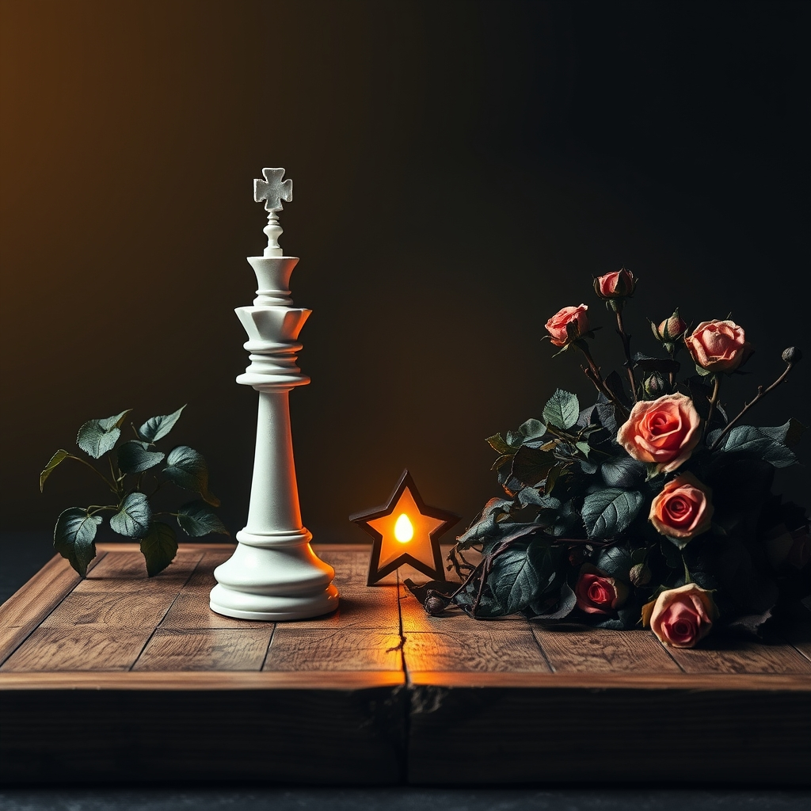

[Home](../index.md) > [Reflections](./index.md) | [⏮️](./2025-03-08.md) [⏭️](./2025-03-10.md)  
# 2025-03-09 | ♟️ Strategy | 🥀 Corruption | 🌟 Meaning  
  
## 📚 Books  
- [♟️🧠📈🎯 The Art of Strategy: A Game Theorist's Guide to Success in Business and Life](../books/the-art-of-strategy-a-game-theorists-guide-to-success-in-business-and-life.md)  
- [💰🏛️💔🇺🇸 On Corruption in America: And What Is at Stake](../books/on-corruption-in-america-and-what-is-at-stake.md)  
- [💰👑👎🇺🇸 Corruption and Illiberal Politics in the Trump Era](../books/corruption-and-illiberal-politics-in-the-trump-era.md)  
- [🔦💡 Man's Search for Meaning](../books/mans-search-for-meaning.md)  
  
## 📰 News  
- [Murphy: Six Weeks In, This White House Is On Its Way To Being The Most Corrupt In U.S. History](../videos/murphy-six-weeks-in-this-white-house-is-on-its-way-to-being-the-most-corrupt-in-u-s-history.md)  
  
## 🦋 Bluesky    
<blockquote class="bluesky-embed" data-bluesky-uri="at://did:plc:i4yli6h7x2uoj7acxunww2fc/app.bsky.feed.post/3msuznmsymv25" data-bluesky-cid="bafyreidzkpu7u3raqtw4m2dvehdf24flu7byozaqhahapxephtgimzajmi">
2025-03-09 | ♟️ Strategy | 🥀 Corruption | 🌟 Meaning  
  
#AI Q: ⚖️ Can strategy survive in a corrupt system?  
  
🎲 Game Theory | ⚖️ Political Ethics | 🧠 Psychology | 🏛️ Governance  
https://bagrounds.org/reflections/2025-03-09
&mdash; <a href="https://bsky.app/profile/did:plc:i4yli6h7x2uoj7acxunww2fc?ref_src=embed">Bryan Grounds (@bagrounds.bsky.social)</a> <a href="https://bsky.app/profile/did:plc:i4yli6h7x2uoj7acxunww2fc/post/3msuznmsymv25?ref_src=embed">2026-08-12T11:29:39.000Z</a></blockquote>