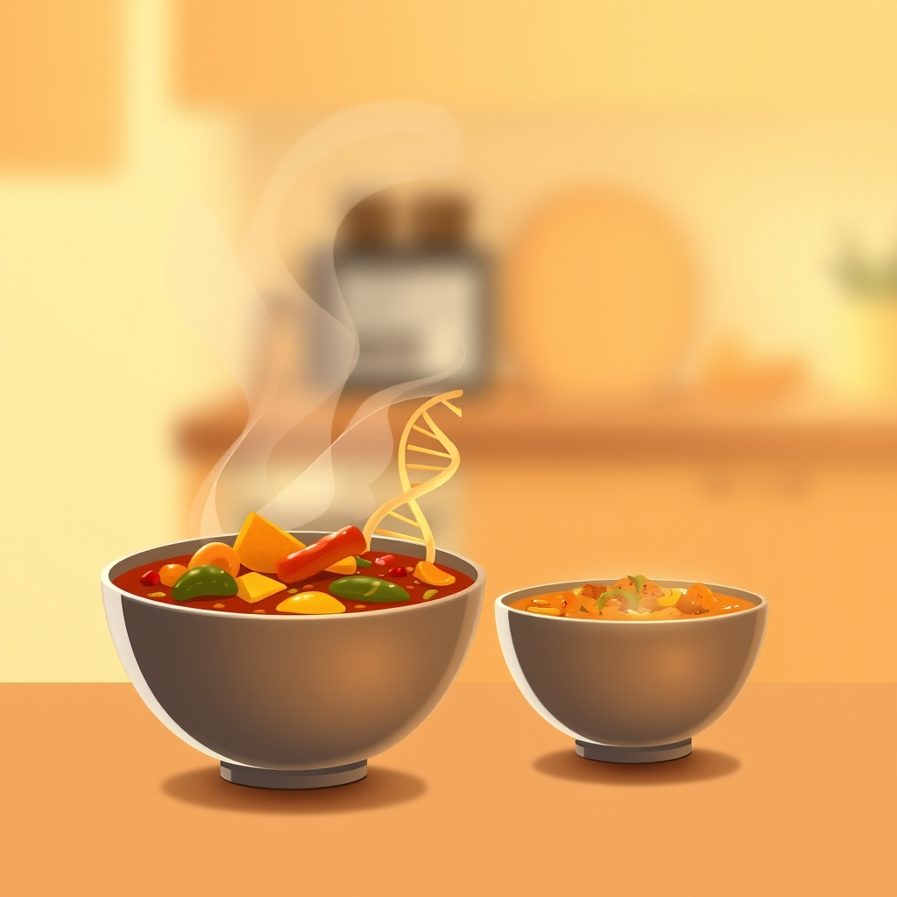

[Home](../index.md) > [Reflections](./index.md) | [⏮️](./2025-03-10.md) [⏭️](./2025-03-12.md)  
# 2025-03-11 | Curry 🍛 | Clone 🧬  
  
## 📚 Books  
- [🐣🌱👨‍🏫💻 Haskell Programming from First Principles](../books/haskell-programming-from-first-principles.md)  
- [👨‍🏫🎉👍✨ Learn You a Haskell for Great Good!](../books/learn-you-a-haskell-for-great-good.md)  
- [👯💻 Digital Twin](../books/the-digital-twin.md)