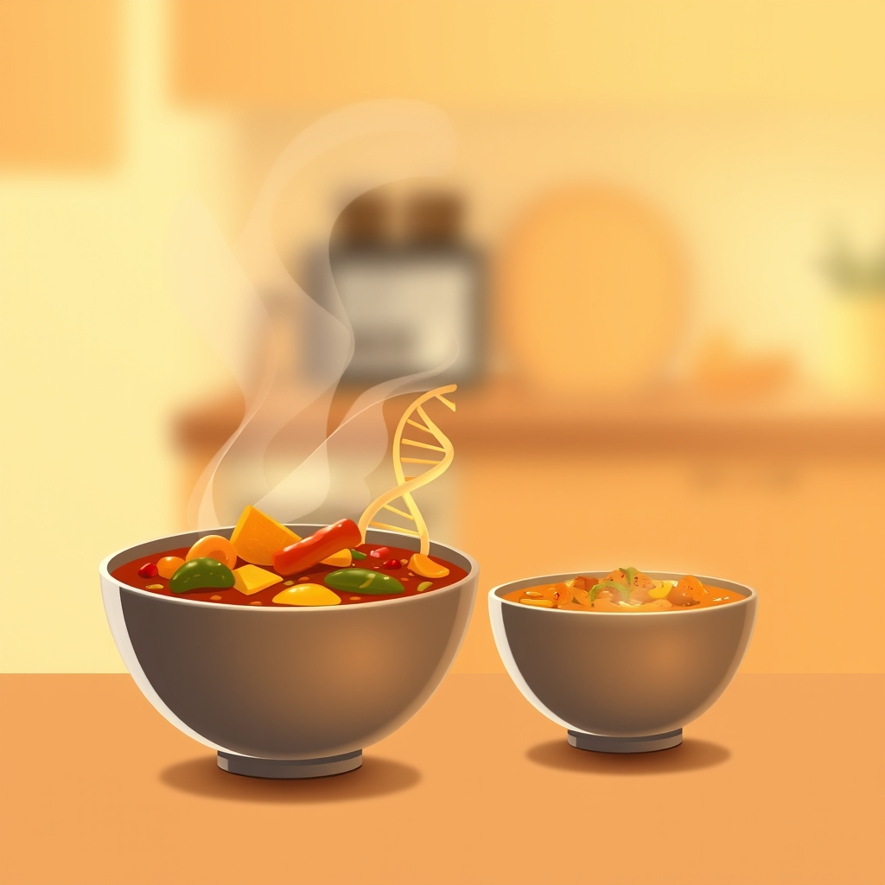

[Home](../index.md) > [Reflections](./index.md) | [⏮️](./2025-03-10.md) [⏭️](./2025-03-12.md)  
# 2025-03-11 | Curry 🍛 | Clone 🧬  
  
## 📚 Books  
- [🐣🌱👨‍🏫💻 Haskell Programming from First Principles](../books/haskell-programming-from-first-principles.md)  
- [👨‍🏫🎉👍✨ Learn You a Haskell for Great Good!](../books/learn-you-a-haskell-for-great-good.md)  
- [👯💻 Digital Twin](../books/the-digital-twin.md)  
  
## 🦋 Bluesky    
<blockquote class="bluesky-embed" data-bluesky-uri="at://did:plc:i4yli6h7x2uoj7acxunww2fc/app.bsky.feed.post/3mryjc6vyzu2j" data-bluesky-cid="bafyreifba62vf2mnjpp7n46efrrppvweurkw7hgv6ivfb2r4w36idmbw2a">
2025-03-11 | Curry 🍛 | Clone 🧬  
  
#AI Q: 🧬 Would you choose to live as a digital clone of yourself?  
  
💻 Functional Programming | 👯 Virtual Models | 📖 Technical Learning  
https://bagrounds.org/reflections/2025-03-11
&mdash; <a href="https://bsky.app/profile/did:plc:i4yli6h7x2uoj7acxunww2fc?ref_src=embed">Bryan Grounds (@bagrounds.bsky.social)</a> <a href="https://bsky.app/profile/did:plc:i4yli6h7x2uoj7acxunww2fc/post/3mryjc6vyzu2j?ref_src=embed">2026-08-01T03:22:23.000Z</a></blockquote>