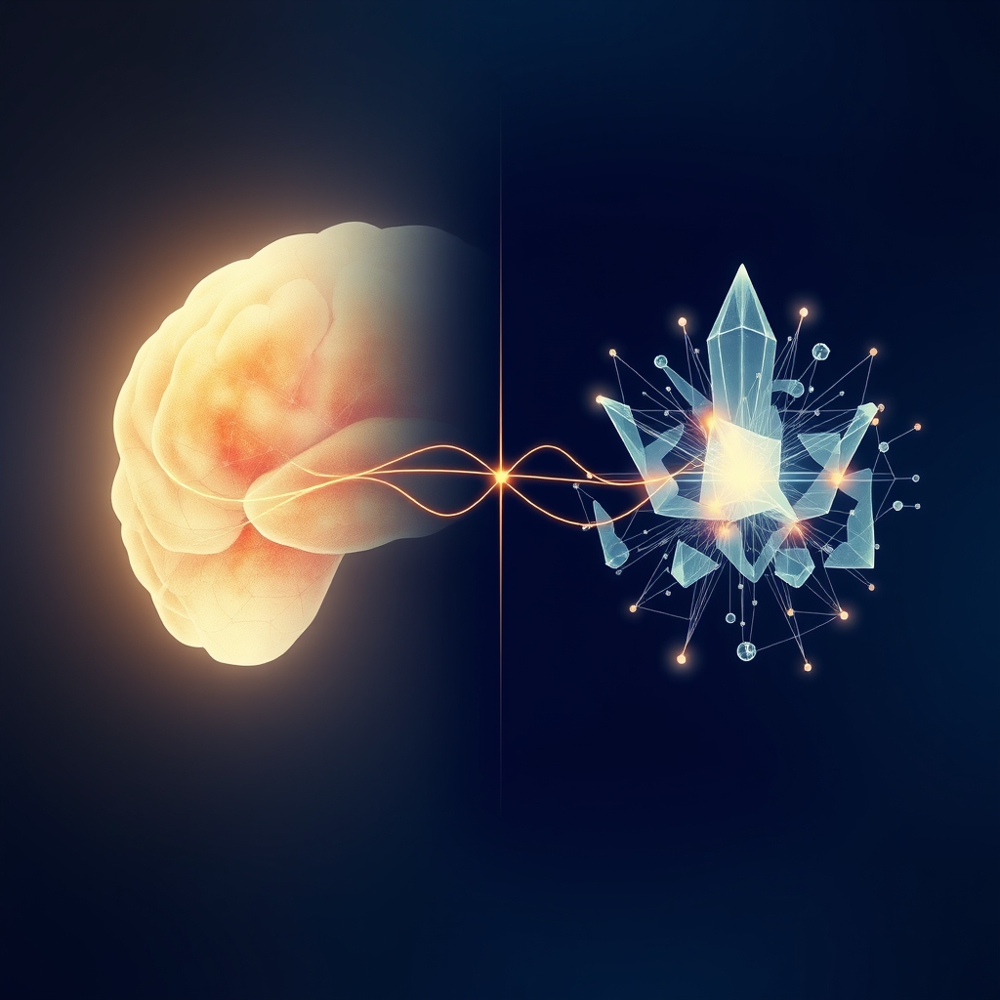

[Home](../index.md) > [Reflections](./index.md) | [⏮️](./2025-03-11.md) [⏭️](./2025-03-13.md)  
# 2025-03-12 | 🧠 Intelligences 🤖  
  
## 📺 Videos  
- [Tools to Enhance Working Memory & Attention](../videos/tools-to-enhance-working-memory-and-attention.md)  
- [How “Digital Twins” Could Help Us Predict the Future | Karen Willcox | TED](../videos/how-digital-twins-could-help-us-predict-the-future-karen-willcox-ted.md)  
  
## 📚 Books  
- [🤔💻🧠 Algorithms to Live By: The Computer Science of Human Decisions](../books/algorithms-to-live-by.md)  
- [🚫❌🧮💭 How Not to Be Wrong: The Power of Mathematical Thinking](../books/how-not-to-be-wrong.md)  
- [📡🌫️🔮🎲 The Signal and the Noise: Why So Many Predictions Fail - but Some Don't](../books/the-signal-and-the-noise.md)  
- [💰🤔😊 Psychology of Money: Timeless lessons on wealth, greed, and happiness](../books/the-psychology-of-money.md)  
- [🌅🧑‍🤝‍🧑 The Dawn of Everything: A New History of Humanity](../books/the-dawn-of-everything-a-new-history-of-humanity.md)  
- [🤸😊🎯🌟 The Art of Living: The Classical Manual on Virtue, Happiness, and Effectiveness](../books/the-art-of-living.md)  
- [🧭🕰️🥇🗺️ Longitude: The True Story of a Lone Genius Who Solved the Greatest Scientific Problem of His Time](../books/longitude.md)  
- [💡🌱♾️ The Creative Habit: Learn It and Use It for Life](../books/the-creative-habit.md)  
- [🌊🧠🙏⚔️ River of the Gods: Genius, Belief, and Betrayal in the Search for the Source of the Nile](../books/river-of-the-gods.md)  
- [✨🎭🧘‍♂️🌌 The Creative Act: A Way of Being](../books/the-creative-act.md)  
- [😈🌍🔬🕯️🌑 The Demon-Haunted World: Science as a Candle in the Dark](../books/the-demon-haunted-world.md)